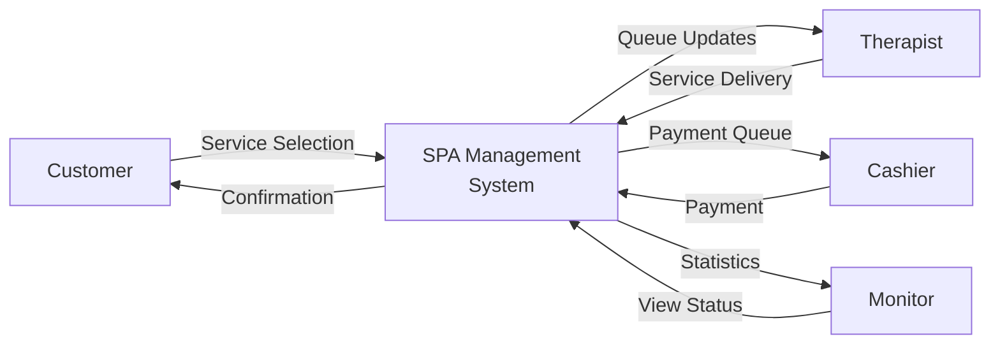

# CHAPTER 3 - METHODOLOGY/SYSTEM DESIGN: Complete Writing Guide

## Overview

This guide provides **specific topics and content** you need to include for each section of Chapter 3 based on your thesis template. Your existing documentation is already comprehensive—this guide shows you how to organize and supplement it.

---

## Status of Your Documentation

### ✅ **COMPLETED SECTIONS** (You already have excellent content)

1. **3.2 Conceptual Framework** → `THESIS_CHAPTER3_CONCEPTUAL_FRAMEWORK.md`
2. **3.3 System Architecture** → `CHAPTER_3_SYSTEM_ARCHITECTURE.md`
3. **3.6 Tools and Technologies Used** → `THESIS_TOOLS_AND_TECHNOLOGIES_COMPLETE.md`
4. **3.7 System Modules and Functions** → `CHAPTER_3_SYSTEM_MODULES_AND_FUNCTIONS.md`

### ⚠️ **SECTIONS TO CREATE**

1. **3.1 Research Design** (Missing)
2. **3.4 Data Flow Diagram (DFD)** (Partially complete - needs academic write-up)
3. **3.5 Entity Relationship Diagram (ERD)** (Diagram exists - needs academic description)

---

## Section-by-Section Guide

---

## 3.1 Research Design ⚠️ TO CREATE

### What to Include:

#### 3.1.1 Research Approach/Framework

**Describe the development approach:**

1. **Development Methodology**
   - Software Development Life Cycle (SDLC) model used
   - Why this approach was chosen
   - Phases of development

**For your system, write about:**

**Agile/Iterative Development Approach** (or whatever you used)

```
Example structure:

The development of the SPA Management System employed an iterative 
development approach aligned with the Agile methodology, allowing for 
continuous refinement based on emerging requirements and stakeholder 
feedback. This approach was selected due to the exploratory nature of 
designing a real-time multi-user spa management solution where 
requirements evolved as technical challenges emerged.

Development Phases:
1. Requirements Analysis and Planning
2. System Design and Architecture
3. Iterative Implementation 
4. Testing and Validation
5. Deployment and Documentation
```

#### 3.1.2 System Design Approach

**Explain your design philosophy:**

```
Topics to cover:

1. **Model-View-Controller (MVC) Pattern Selection**
   - Why MVC was chosen
   - How it fits spa management requirements
   - Benefits for maintainability

2. **Three-Tier Architecture Decision**
   - Rationale for client-server separation
   - Scalability considerations
   - Security isolation benefits

3. **Real-Time Communication Requirement**
   - Why traditional HTTP is insufficient
   - Need for WebSocket technology
   - Multi-user synchronization challenges

4. **Database-First vs. Code-First Design**
   - Which approach you used
   - Rationale for the choice
```

#### 3.1.3 Development Environment

**Describe your development setup:**

```
1. **Hardware Environment**
   - Development machine specifications
   - Server requirements (if applicable)
   - Network setup

2. **Software Environment**
   - Operating System
   - XAMPP for local development
   - Python virtual environment
   - Code editor/IDE

3. **Version Control**
   - Git for version management
   - Repository structure
```

#### 3.1.4 Research Method Summary

**Create a table:**

| Aspect | Method/Approach | Justification |
|--------|----------------|---------------|
| Development Model | Iterative/Agile | Allows requirement evolution |
| Architectural Pattern | MVC + Three-Tier | Separation of concerns, scalability |
| Database Design | Relational (MySQL) | ACID compliance, data integrity |
| Testing Approach | Manual + Integration Testing | Ensures real-time functionality |
| Documentation | Technical + Academic | Comprehensive knowledge transfer |

---

## 3.2 Conceptual Framework ✅ COMPLETE

**You already have:** `THESIS_CHAPTER3_CONCEPTUAL_FRAMEWORK.md`

**This file includes:**
- ✅ Theoretical foundation (MVC, 3-tier, event-driven, ACID)
- ✅ Input-Process-Output (IPO) model
- ✅ System components and relationships
- ✅ Architectural paradigms
- ✅ Data flow framework
- ✅ Comprehensive conceptual framework diagram
- ✅ Academic references

**Action:** Use this file as-is or copy relevant sections to your main Chapter 3.

---

## 3.3 System Architecture ✅ COMPLETE

**You already have:** `CHAPTER_3_SYSTEM_ARCHITECTURE.md`

**This file includes:**
- ✅ Three-tier architecture explanation
- ✅ MVC pattern implementation
- ✅ System components (10 tables described)
- ✅ Route blueprints
- ✅ Socket.IO event handlers
- ✅ Data flow architecture with diagrams
- ✅ Communication architecture
- ✅ Database architecture with ERD
- ✅ Security architecture
- ✅ Performance optimization
- ✅ System workflows
- ✅ Technology justification

**Action:** This is complete and academically formatted. Use as-is.

---

## 3.4 Data Flow Diagram (DFD) ⚠️ NEEDS ACADEMIC WRITE-UP

### What to Include:

You have diagrams in `THESIS_DIAGRAMS_SIMPLIFIED.md`, but need academic descriptions.

#### 3.4.1 DFD Overview

**Write an introduction:**

```
Example:

The Data Flow Diagram (DFD) illustrates how data moves through the 
SPA Management System, showing the transformation of inputs into 
outputs through various processes. The system implements a multi-level 
DFD approach: Context Diagram (Level 0) shows the system as a whole, 
and Level 1 DFD decomposes the system into major processes.
```

#### 3.4.2 Context Diagram (Level 0)

**Create and describe:**



**Academic Description:**

```
The context diagram (Figure 3.X) presents the SPA Management System 
as a single process interacting with four external entities:

1. **Customer (External Entity)**: Provides service selection data and 
   receives transaction confirmations.

2. **Therapist (External Entity)**: Submits service delivery data 
   (start, finish) and receives queue updates.

3. **Cashier (External Entity)**: Processes payment information and 
   receives payment queue notifications.

4. **Monitor (External Entity)**: Requests system statistics and 
   receives real-time operational data.

Data flows represent the movement of information between entities and 
the system, including service selections, queue updates, payment 
records, and monitoring statistics.
```

#### 3.4.3 Level 1 DFD

**Create a decomposed DFD showing major processes:**

```
Processes to show:

P1: Service Selection Processing
    Input: Selected services, classifications
    Output: Transaction record, queue notification
    Data Store: Services, Transactions

P2: Queue Management
    Input: Therapist claim request
    Output: Assigned transaction
    Data Store: Transactions, Therapists

P3: Service Delivery Tracking
    Input: Service start/finish events
    Output: Updated transaction status
    Data Store: Transactions, TransactionItems

P4: Payment Processing
    Input: Payment amount
    Output: Payment record, change
    Data Store: Transactions, Payments

P5: Real-Time Broadcasting
    Input: System events
    Output: WebSocket notifications
    Data Store: None (in-memory)
```

#### 3.4.4 Data Flow Description Table

| Data Flow | Source | Destination | Data Elements |
|-----------|--------|-------------|---------------|
| Service Selection | Customer | Process 1 | Service IDs, Classification IDs, Quantities |
| Transaction Record | Process 1 | Data Store D1 | Transaction ID, Code, Total, Items |
| Queue Notification | Process 1 | Process 5 | Transaction details |
| Claim Request | Therapist | Process 2 | Therapist ID, Token |
| Assigned Transaction | Process 2 | Therapist | Transaction details, Customer info |

#### 3.4.5 Data Store Description

| Data Store | Description | Data Elements |
|------------|-------------|---------------|
| D1: Services | Service catalog | Service ID, Name, Price, Duration |
| D2: Transactions | Customer transactions | Transaction ID, Code, Status, Timestamps |
| D3: Therapists | Staff information | Therapist ID, Name, Room, Availability |
| D4: Payments | Financial records | Payment ID, Amount, Change, Timestamp |

---

## 3.5 Entity Relationship Diagram (ERD) ⚠️ NEEDS ACADEMIC DESCRIPTION

### What to Include:

You already have the ERD diagram in `erd_clean.md`. You need to add **academic descriptions**.

#### 3.5.1 ERD Overview

**Write an introduction:**

```
Example:

The Entity Relationship Diagram (ERD) represents the database schema 
of the SPA Management System, illustrating the entities (tables), 
attributes (columns), and relationships that support the system's 
data persistence requirements. The schema follows Third Normal Form 
(3NF) principles to minimize data redundancy and ensure data integrity.

The database consists of 10 primary entities organized into four 
functional domains:
1. Service Management (ServiceCategory, Service, ServiceClassification)
2. User Management (Therapist, Cashier)
3. Transaction Management (Transaction, TransactionItem, TransactionCounter)
4. Supporting Entities (Payment, Room)
```

#### 3.5.2 Entity Descriptions

**For EACH entity in your ERD, write:**

**Example: Transaction Entity**

```
**Entity: Transaction**

**Purpose:** 
Represents a customer's service request lifecycle from initial 
selection through payment completion.

**Primary Key:** 
- id (INT): Auto-incrementing unique identifier

**Foreign Keys:**
- therapist_id (FK → Therapist): References assigned therapist
- assigned_cashier_id (FK → Cashier): References payment processor

**Key Attributes:**
- code (VARCHAR(4), UNIQUE): Sequential 4-digit transaction identifier 
  for customer reference
- status (ENUM): Current transaction state (8 possible states from 
  'selecting' to 'paid')
- total_amount (FLOAT): Computed sum of all transaction items
- total_duration_minutes (INT): Expected service duration

**Timestamp Attributes (Audit Trail):**
- created_at: Transaction initiation
- selection_confirmed_at: Customer confirmation
- therapist_confirmed_at: Therapist assignment
- service_start_at: Service commencement
- service_finish_at: Service completion
- cashier_claimed_at: Cashier assignment
- paid_at: Payment finalization

**Business Rules:**
1. Code must be unique across all transactions
2. Status transitions must follow defined workflow
3. Total amount is recomputed when items are added/removed
4. Timestamps must follow chronological order
```

**Repeat for all 10 entities:**

1. **TransactionCounter**
   - Purpose: Singleton for sequential code generation
   - Key: Ensures unique transaction codes

2. **ServiceCategory**
   - Purpose: High-level service grouping
   - Example: Massage, Facial, Body Treatment

3. **Service**
   - Purpose: Specific service offerings
   - Example: Swedish Massage, Hot Stone Therapy

4. **ServiceClassification**
   - Purpose: Pricing and duration tiers
   - Example: 60min/₱500, 90min/₱700, 120min/₱900

5. **Therapist**
   - Purpose: Staff providing services
   - Security: Password hashing, token authentication

6. **Cashier**
   - Purpose: Payment processing staff
   - Security: Password hashing, token authentication

7. **TransactionItem**
   - Purpose: Line items in transactions
   - Denormalization: Stores price/duration for historical accuracy

8. **Payment**
   - Purpose: Financial transaction records
   - Audit: Amount paid, change, payment method

9. **Room**
   - Purpose: Treatment room management
   - Status tracking: available, occupied, preparing

10. **TransactionCounter**
    - Purpose: Sequential code generator
    - Pattern: Singleton

#### 3.5.3 Relationship Descriptions

**For each relationship, describe:**

**Example:**

```
**Relationship: ServiceCategory → Service (One-to-Many)**

**Cardinality:** One ServiceCategory can contain zero or more Services

**Participation:** 
- ServiceCategory: Optional (can exist without services)
- Service: Mandatory (must belong to a category)

**Foreign Key:** Service.category_id references ServiceCategory.id

**Business Rule:** When a ServiceCategory is deleted, all associated 
Services are also deleted (CASCADE DELETE).

**Example:** The "Massage" category contains services: Swedish Massage, 
Thai Massage, Hot Stone Massage.
```

**Document all relationships:**

1. ServiceCategory → Service (1:N)
2. Service → ServiceClassification (1:N)
3. Service → TransactionItem (1:N)
4. ServiceClassification → TransactionItem (1:N)
5. Therapist → Transaction (1:N)
6. Cashier → Transaction (1:N)
7. Cashier → Payment (1:N)
8. Transaction → TransactionItem (1:N)
9. Transaction → Payment (1:1)
10. Transaction → Room (N:1)

#### 3.5.4 Normalization Analysis

**Explain your normalization:**

```
**Third Normal Form (3NF) Compliance:**

The database schema adheres to Third Normal Form through the following 
design decisions:

**1st Normal Form (1NF):**
- All attributes contain atomic values
- No repeating groups (services stored in separate TransactionItem records)
- Each table has a primary key

**2nd Normal Form (2NF):**
- All non-key attributes depend on the entire primary key
- ServiceClassification separated from Service to eliminate partial dependencies
- TransactionItem stores denormalized price/duration for historical accuracy

**3rd Normal Form (3NF):**
- No transitive dependencies
- ServiceCategory separated from Service
- Therapist and Cashier information not duplicated in Transaction
- Room status tracked separately from Transaction

**Controlled Denormalization:**
TransactionItem stores price and duration_minutes (duplicating data from 
ServiceClassification) to preserve historical pricing when service rates 
change. This intentional denormalization ensures transaction records 
remain accurate regardless of future price updates.
```

#### 3.5.5 Integrity Constraints

**Document constraints:**

```
**1. Entity Integrity:**
- All tables have primary keys (auto-incrementing integers)
- Primary keys cannot be NULL

**2. Referential Integrity:**
- Foreign keys enforce valid relationships
- CASCADE DELETE: Deleting Service removes ServiceClassifications
- RESTRICT DELETE: Cannot delete Therapist with active transactions

**3. Domain Integrity:**
- Status ENUM limits values to valid states
- Boolean fields for active status (Therapist, Cashier)
- FLOAT for monetary values (consistent decimal handling)

**4. User-Defined Integrity:**
- UNIQUE constraints: Transaction.code, Therapist.username, Cashier.username
- CHECK constraints: amount_paid >= amount_due (application-level)
- NOT NULL constraints on critical fields
```

---

## 3.6 Tools and Technologies Used ✅ COMPLETE

**You already have:** `THESIS_TOOLS_AND_TECHNOLOGIES_COMPLETE.md`

**This file includes:**
- ✅ Backend technologies (Python, Flask, SQLAlchemy, etc.)
- ✅ Database (MySQL with full justification)
- ✅ Frontend technologies (HTML5, CSS3, JavaScript)
- ✅ Development tools (XAMPP, venv)
- ✅ Supporting libraries with explanations
- ✅ Security considerations
- ✅ Technology summary table
- ✅ All justifications and alternatives

**Action:** This is complete. Use as-is.

---

## 3.7 System Modules and Functions ✅ COMPLETE

**You already have:** `CHAPTER_3_SYSTEM_MODULES_AND_FUNCTIONS.md`

**This file includes:**
- ✅ Module architecture explanation
- ✅ Customer Service Selection Module
- ✅ Therapist Service Management Module
- ✅ Cashier Payment Processing Module
- ✅ Real-Time Monitoring Module
- ✅ Authentication and Authorization Module
- ✅ Supporting modules
- ✅ Module integration and communication
- ✅ Function summary table

**Action:** This is complete. Use as-is.

---

## Quick Action Plan

### What You Need to Do:

1. **CREATE 3.1 Research Design** (≈ 2-3 pages)
   - Development methodology used
   - System design approach
   - Development environment
   - Research method summary table

2. **ENHANCE 3.4 Data Flow Diagram** (≈ 3-4 pages)
   - Add Context Diagram (Level 0) with description
   - Create Level 1 DFD showing 5 main processes
   - Add data flow description table
   - Add data store description table
   - Use diagrams from THESIS_DIAGRAMS_SIMPLIFIED.md

3. **ENHANCE 3.5 Entity Relationship Diagram** (≈ 4-5 pages)
   - Keep existing ERD from erd_clean.md
   - Add ERD overview paragraph
   - Add detailed description for each of 10 entities
   - Add description for each relationship
   - Add normalization analysis
   - Add integrity constraints explanation

4. **COMPILE** all sections into final Chapter 3

---

## Chapter 3 Final Structure

```
CHAPTER 3 - METHODOLOGY / SYSTEM DESIGN

3.1 Research Design ................................. [CREATE - 2-3 pages]
    3.1.1 Development Approach
    3.1.2 System Design Philosophy
    3.1.3 Development Environment
    3.1.4 Research Method Summary

3.2 Conceptual Framework ........................... [COMPLETE - 8-10 pages]
    → Use: THESIS_CHAPTER3_CONCEPTUAL_FRAMEWORK.md

3.3 System Architecture ............................ [COMPLETE - 15-18 pages]
    → Use: CHAPTER_3_SYSTEM_ARCHITECTURE.md

3.4 Data Flow Diagram (DFD) ........................ [ENHANCE - 3-4 pages]
    3.4.1 DFD Overview
    3.4.2 Context Diagram (Level 0)
    3.4.3 Level 1 DFD
    3.4.4 Data Flow Description
    3.4.5 Data Store Description

3.5 Entity Relationship Diagram (ERD) .............. [ENHANCE - 4-5 pages]
    3.5.1 ERD Overview
    3.5.2 Entity Descriptions (10 entities)
    3.5.3 Relationship Descriptions
    3.5.4 Normalization Analysis
    3.5.5 Integrity Constraints

3.6 Tools and Technologies Used .................... [COMPLETE - 10-12 pages]
    → Use: THESIS_TOOLS_AND_TECHNOLOGIES_COMPLETE.md

3.7 System Modules and Functions ................... [COMPLETE - 18-20 pages]
    → Use: CHAPTER_3_SYSTEM_MODULES_AND_FUNCTIONS.md

TOTAL ESTIMATED LENGTH: 60-75 pages
```

---

## Tips for Academic Writing

### General Guidelines:

1. **Passive Voice for Technical Sections**
   - ✅ "The system was designed using..."
   - ❌ "We designed the system using..."

2. **Present Tense for System Description**
   - ✅ "The database stores..."
   - ✅ "The system employs..."

3. **Past Tense for Development Process**
   - ✅ "Python was selected..."
   - ✅ "The architecture was designed..."

4. **Justify Every Decision**
   - Always explain WHY, not just WHAT
   - Compare with alternatives
   - Reference standards/best practices

5. **Use Figures and Tables**
   - Every diagram needs a figure number and caption
   - Reference figures in text: "as shown in Figure 3.5"
   - Tables should summarize complex information

6. **Citations**
   - Reference architectural patterns (MVC, 3-tier)
   - Cite database theory (normalization, ACID)
   - Reference security standards (password hashing)

---

## Next Steps

### Immediate Actions:

1. **Read this guide completely**
2. **Review your existing complete sections** (3.2, 3.3, 3.6, 3.7)
3. **Create 3.1 Research Design** using the template above
4. **Enhance 3.4 DFD** by adding academic descriptions to diagrams
5. **Enhance 3.5 ERD** by adding entity and relationship descriptions
6. **Compile everything** into a single Chapter 3 document

### Estimated Time:

- 3.1 Research Design: 2-3 hours
- 3.4 DFD Enhancement: 2-3 hours  
- 3.5 ERD Enhancement: 3-4 hours
- Compilation and formatting: 1-2 hours

**Total: 8-12 hours of focused work**

---

## Quality Checklist

Before submitting Chapter 3, verify:

- [ ] All sections follow the template structure
- [ ] Every diagram has a figure number and caption
- [ ] All figures are referenced in the text
- [ ] Every technical decision is justified
- [ ] Alternatives are mentioned and compared
- [ ] Academic tone is consistent (third person, formal)
- [ ] All tables are formatted consistently
- [ ] References are cited properly
- [ ] Page numbers and section numbers are correct
- [ ] No grammar or spelling errors
- [ ] Consistent terminology throughout

---

## Need Help?

If you need specific examples for any section, ask for:
- "Example paragraph for 3.1.1 Development Approach"
- "Sample entity description for Payment table"
- "Example DFD Level 1 for my system"

I can generate specific content for any section you need!
