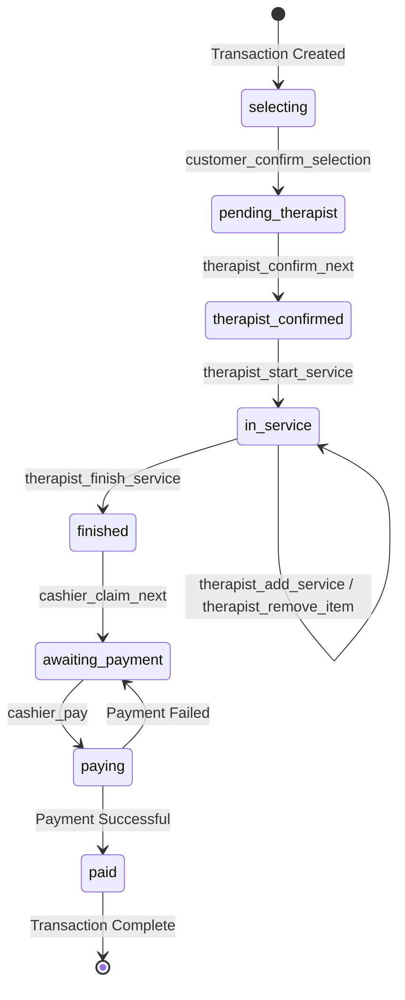

# CHAPTER 3: METHODOLOGY - MISSING SYSTEM ARCHITECTURE SECTIONS
## Additional Sections to Integrate into System Architecture

**Note:** These sections address components and architectural patterns that exist in the system but were not fully documented in the original architecture section. Integrate these into the appropriate locations in Section 3.3.

---

## 3.3.7.3 Token Lifecycle Management

The system implements a sophisticated token-based authentication mechanism with automatic expiration and renewal capabilities to balance security with user experience.

### Token Generation and Storage

Upon successful authentication, the system generates a cryptographically secure token using Python's `secrets.token_urlsafe(32)` function, which produces a URL-safe Base64-encoded random string of 32 bytes, providing 256 bits of entropy. This token is stored in the database alongside the user record (Therapist or Cashier) and associated with an expiration timestamp.

**Token Creation Process:**
```python
token = secrets.token_urlsafe(32)
user.auth_token = token
user.token_expires_at = datetime.now() + timedelta(hours=24)
```

### Token Expiration Strategy

The system employs a **sliding window expiration mechanism** that provides:

1. **Initial Expiration**: Tokens are valid for 24 hours from creation
2. **Automatic Extension**: Each successful token validation extends the expiration by an additional 24 hours
3. **Absolute Security**: Expired tokens are immediately invalidated and removed from the database

This sliding window approach ensures that actively used sessions remain valid indefinitely, while inactive sessions automatically expire after 24 hours of inactivity, reducing the risk of unauthorized access from abandoned sessions.

### Token Invalidation

Tokens are invalidated under the following conditions:

1. **Explicit Logout**: User-initiated logout immediately nullifies the token
2. **Expiration**: Automatic invalidation when the expiration timestamp is reached
3. **Security Events**: Administrative token revocation (if implemented)

### Security Considerations

The token lifecycle management addresses several security concerns:

- **Token Entropy**: 256-bit entropy prevents brute-force attacks
- **Storage Security**: Tokens are stored server-side in the database, not exposed in URLs
- **Transmission Security**: Tokens transmitted via Authorization header using Bearer scheme
- **Automatic Cleanup**: Expired tokens are cleared from database, preventing token accumulation
- **Session Fixation Prevention**: New token generated on each login, preventing session fixation attacks

---

## 3.3.7.4 Dual Authentication Mechanism

The system implements a **hybrid authentication architecture** that supports both token-based and session-based authentication with automatic fallback, providing flexibility for different client types and use cases.

### Authentication Hierarchy

The authentication mechanism follows a priority-based validation sequence:

**Priority 1: Token-Based Authentication**
- Client includes token in request headers (`Authorization: Bearer <token>` or `X-Auth-Token: <token>`)
- Suitable for API clients, mobile applications, and WebSocket connections
- Stateless authentication, reducing server-side session storage requirements

**Priority 2: Session-Based Authentication**
- Client relies on Flask session cookies
- Suitable for traditional web browsers with cookie support
- Stateful authentication, managed by Flask session framework

### Token Extraction Strategy

The system attempts to extract authentication tokens from multiple sources in the following order:

1. **Authorization Header**: `Authorization: Bearer <token>`
2. **Custom Header**: `X-Auth-Token: <token>`
3. **Query Parameter**: `?auth_token=<token>` (for WebSocket connections where headers are limited)

### Architectural Advantages

This dual authentication approach provides several benefits:

1. **Flexibility**: Supports various client types (browsers, mobile apps, APIs)
2. **Backward Compatibility**: Existing session-based clients continue to function
3. **Progressive Enhancement**: New clients can adopt token-based authentication
4. **WebSocket Support**: Query parameter token extraction enables WebSocket authentication
5. **Development Convenience**: Session-based auth simplifies local development and testing

---

## 3.3.8.4 Configuration Management Architecture

The system employs an **environment-based configuration architecture** that separates configuration from code, adhering to the Twelve-Factor App methodology.

### Environment Variable Configuration

Configuration parameters are loaded from environment variables with sensible defaults for development:

**Database Configuration:**
```python
mysql_user = os.getenv("MYSQL_USER", "root")
mysql_password = os.getenv("MYSQL_PASSWORD", "")
mysql_host = os.getenv("MYSQL_HOST", "127.0.0.1")
mysql_port = os.getenv("MYSQL_PORT", "3306")
mysql_db = os.getenv("MYSQL_DB", "test_db")
```

**Application Configuration:**
```python
app.config["SECRET_KEY"] = os.getenv("FLASK_SECRET_KEY", "dev-secret-key")
```

**WebSocket Concurrency Configuration:**
```python
async_mode = os.getenv("SOCKETIO_ASYNC_MODE", "threading")
```

### Configuration Parameters

| Parameter | Purpose | Default Value | Production Recommendation |
|-----------|---------|---------------|---------------------------|
| `MYSQL_USER` | Database username | `root` | Create dedicated application user |
| `MYSQL_PASSWORD` | Database password | Empty string | Strong password, externally managed |
| `MYSQL_HOST` | Database server address | `127.0.0.1` | Database server hostname/IP |
| `MYSQL_PORT` | Database server port | `3306` | Default MySQL port |
| `MYSQL_DB` | Database name | `test_db` | Production database name |
| `FLASK_SECRET_KEY` | Session encryption key | `dev-secret-key` | Cryptographically secure random string |
| `SOCKETIO_ASYNC_MODE` | Socket.IO concurrency model | `threading` | `eventlet` for production scalability |

### Security Benefits

1. **Credential Separation**: Sensitive credentials never committed to version control
2. **Environment Isolation**: Different credentials for development, staging, production
3. **Secret Rotation**: Configuration changes without code deployment
4. **Audit Trail**: Configuration changes tracked in deployment systems, not code repository

### Async Mode Configuration

**Threading Mode (Development):**
- Uses Python threading for concurrent connections
- Simpler debugging with standard debugging tools
- Suitable for low-concurrency development environments

**Eventlet Mode (Production):**
- Uses greenlet-based cooperative multitasking
- Superior performance for I/O-bound WebSocket operations
- Supports hundreds of concurrent connections efficiently

---

## 3.3.9.4 Transaction State Machine

The transaction lifecycle follows a **finite state machine (FSM)** pattern with eight distinct states and defined transitions. This state machine ensures data integrity and enforces business rules throughout the customer service journey.

### State Definitions

| State | Description | Entry Condition | Exit Condition |
|-------|-------------|----------------|----------------|
| `selecting` | Customer browsing services | Transaction created | Customer confirms selection |
| `pending_therapist` | Waiting for therapist assignment | Selection confirmed | Therapist claims transaction |
| `therapist_confirmed` | Therapist assigned, not started | Therapist claims | Therapist starts service |
| `in_service` | Service actively being delivered | Therapist starts | Therapist finishes service |
| `finished` | Service complete, awaiting payment | Service finished | Cashier claims transaction |
| `awaiting_payment` | Cashier assigned, awaiting payment | Cashier claims | Payment initiated |
| `paying` | Payment being processed | Payment initiated | Payment completed |
| `paid` | Transaction complete | Payment confirmed | N/A (terminal state) |

### State Transition Diagram



### State Transition Rules

**Valid Transitions:**

1. **selecting → pending_therapist**
   - **Trigger**: `customer_confirm_selection` Socket.IO event
   - **Validation**: At least one service item selected
   - **Side Effects**: Transaction code generated, queue broadcast

2. **pending_therapist → therapist_confirmed**
   - **Trigger**: `therapist_confirm_next` Socket.IO event
   - **Validation**: Authenticated therapist, available room
   - **Concurrency Control**: Row-level locking with `SKIP LOCKED`
   - **Side Effects**: Therapist assigned, room assigned, timestamp recorded

3. **therapist_confirmed → in_service**
   - **Trigger**: `therapist_start_service` Socket.IO event
   - **Side Effects**: Service start timestamp recorded

4. **in_service → in_service** (reflexive)
   - **Triggers**: `therapist_add_service`, `therapist_remove_item`
   - **Purpose**: Allow service modifications during delivery
   - **Side Effects**: Transaction totals recomputed

5. **in_service → finished**
   - **Trigger**: `therapist_finish_service` Socket.IO event
   - **Side Effects**: Service finish timestamp, moved to cashier queue

6. **finished → awaiting_payment**
   - **Trigger**: `cashier_claim_next` Socket.IO event
   - **Concurrency Control**: Row-level locking with `SKIP LOCKED`
   - **Side Effects**: Cashier assigned, timestamp recorded

7. **awaiting_payment → paying**
   - **Trigger**: `cashier_pay` Socket.IO event
   - **Validation**: Payment amount ≥ total amount

8. **paying → paid**
   - **Automatic Transition**: Upon successful payment validation
   - **Side Effects**: Payment record created, change calculated

9. **paying → awaiting_payment** (error recovery)
   - **Trigger**: Payment validation failure
   - **Purpose**: Allow cashier to retry payment

### Concurrency Control in State Transitions

Critical state transitions employ database-level pessimistic locking:

```python
# Therapist queue claiming
tx = Transaction.query \
    .filter_by(status=TransactionStatus.pending_therapist) \
    .order_by(Transaction.selection_confirmed_at.asc()) \
    .with_for_update(skip_locked=True) \
    .first()
```

**Locking Mechanism:**
- `with_for_update()`: Acquires row-level exclusive lock
- `skip_locked=True`: Skips already-locked rows instead of blocking
- **Result**: Multiple therapists/cashiers can claim transactions concurrently without conflicts

### State Invariants

The state machine enforces the following invariants:

1. **Monotonic Progression**: Transactions generally progress forward through states
2. **Unique Assignment**: Only one therapist and one cashier per transaction
3. **Timestamp Consistency**: Each state transition records timestamp for audit trail
4. **Total Accuracy**: Transaction totals remain consistent with items
5. **Payment Validation**: Cannot reach `paid` state without valid payment record

---

## 3.3.3.5 Data Serialization Layer

The system implements a dedicated **data serialization layer** that transforms database ORM objects into JSON-safe dictionaries for transmission over WebSocket connections and HTTP responses.

### Serialization Architecture

The serialization layer serves as an adapter between the database persistence layer and the communication layer, addressing several challenges:

1. **ORM Object Conversion**: SQLAlchemy ORM objects cannot be directly serialized to JSON
2. **Datetime Formatting**: Python `datetime` objects require ISO 8601 string conversion
3. **Relationship Resolution**: Nested relationships must be resolved and serialized recursively
4. **Circular Reference Prevention**: Bidirectional relationships could cause infinite recursion
5. **Selective Field Exposure**: Not all database fields should be transmitted to clients

### Core Serialization Functions

**DateTime Serialization:**
```python
def _iso(dt: datetime | None) -> str | None:
    if not dt:
        return None
    try:
        return dt.isoformat()
    except Exception:
        return None
```

This utility function converts `datetime` objects to ISO 8601 format (e.g., "2024-10-15T03:30:45").

**Transaction Serialization:**
```python
def serialize_transaction(tx: Transaction) -> dict[str, Any]:
    data = {
        "id": tx.id,
        "code": tx.code,
        "status": tx.status.value,
        "therapist": tx.therapist.name if tx.therapist else None,
        "room_number": tx.room_number,
        "total_amount": tx.total_amount,
        "total_duration_minutes": tx.total_duration_minutes,
        "service_start_at": _iso(tx.service_start_at),
        "items": [
            {
                "id": it.id,
                "service_id": it.service_id,
                "service_name": it.service.service_name,
                "price": it.price,
                "duration_minutes": it.duration_minutes,
            }
            for it in tx.items
        ],
    }
    if tx.payment:
        data["payment"] = {
            "amount_due": tx.payment.amount_due,
            "amount_paid": tx.payment.amount_paid,
            "change_amount": tx.payment.change_amount,
            "method": tx.payment.method,
            "created_at": _iso(tx.payment.created_at),
        }
    return data
```

### Serialization Features

**1. Selective Field Exposure**
- Includes only necessary fields
- Uses human-readable names (e.g., `therapist.name` instead of `therapist_id`)
- Omits sensitive data (password hashes, internal tokens)

**2. Enum Handling**
```python
"status": tx.status.value  # "in_service" instead of <TransactionStatus.in_service>
```

**3. Optional Relationship Handling**
```python
"therapist": tx.therapist.name if tx.therapist else None
```

**4. Nested Collection Serialization**
```python
"items": [item_dict for item in tx.items]
```

**5. Conditional Serialization**
```python
if tx.payment:
    data["payment"] = {...}
```

### Benefits of Centralized Serialization

1. **Consistency**: All transaction data transmitted in identical format
2. **Maintainability**: Changes to serialization logic made in single location
3. **Type Safety**: Function signature documents expected input and output types
4. **Testability**: Serialization logic can be unit tested independently

---

## 3.3.6.3 Room Management Architecture

The system implements a **room allocation and tracking architecture** that manages physical treatment rooms and their assignment to therapists and transactions.

### Room Entity Model

| Attribute | Type | Purpose |
|-----------|------|---------|
| `id` | Integer | Primary key |
| `room_number` | String(20) | Human-readable room identifier |
| `status` | String(20) | Current room state: `available`, `occupied`, `preparing` |
| `current_transaction_id` | Foreign Key | Reference to active transaction |
| `current_transaction` | Relationship | ORM relationship to Transaction |

### Room Status Lifecycle

**1. Available**
- Room is clean, prepared, and ready for next customer
- Can be assigned to incoming transactions
- No current transaction association

**2. Occupied**
- Room actively being used for service delivery
- Associated with specific transaction
- Cannot be assigned to new transactions

**3. Preparing**
- Service completed, room being cleaned/prepared
- Transitional state between occupied and available

### Room Assignment Strategy

Each therapist is pre-assigned a specific room number stored in the `Therapist` entity:
```python
class Therapist(db.Model):
    room_number = db.Column(String(20), nullable=True)
```

When a therapist claims a customer, their pre-assigned room is automatically associated with the transaction:
```python
tx.therapist = therapist
tx.room_number = therapist.room_number
```

### Room Assignment Benefits

1. **Simplified Workflow**: Therapists always work in their designated room
2. **Personalization**: Therapists can personalize their rooms
3. **Accountability**: Clear ownership of room cleanliness and organization
4. **Customer Experience**: Customers know immediately which room to visit

---

## 3.3.6.4 Service Classification Hierarchy

The system implements a **three-level hierarchical service model** that provides flexibility in service offerings, pricing variations, and duration options.

### Hierarchical Structure

```
ServiceCategory (Level 1: Category)
    └── Service (Level 2: Service Type)
            └── ServiceClassification (Level 3: Pricing Tier)
```

**Example Hierarchy:**
```
Massage (Category)
    ├── Swedish Massage (Service)
    │   ├── 30 minutes - $50 (Classification)
    │   ├── 60 minutes - $80 (Classification)
    │   └── 90 minutes - $110 (Classification)
    └── Deep Tissue Massage (Service)
        ├── 60 minutes - $95 (Classification)
        └── 90 minutes - $130 (Classification)
```

### Entity Definitions

**Level 1: ServiceCategory**
- High-level grouping of related services
- Examples: Massage, Facial, Body Treatment

**Level 2: Service**
- Specific service type within a category
- Examples: Swedish Massage, Deep Tissue Massage
- Includes description and service-level metadata

**Level 3: ServiceClassification**
- Specific pricing tier, duration, or variant
- Examples: 30 minutes, 60 minutes, 90 minutes
- Stores price and duration_minutes

### Architectural Benefits

**1. Pricing Flexibility**
- Multiple pricing tiers without data duplication
- Different durations at different prices
- Quality tiers (Standard, Premium, VIP)

**2. Data Normalization**
- Service descriptions stored once at Service level
- Only pricing and duration vary at Classification level

**3. Scalability**
- Easy to add new categories without affecting existing services
- Add pricing tiers without schema changes

**4. Query Efficiency**
- Hierarchical relationships enable efficient queries
- Easy to retrieve all options for display

### Transaction Item Linkage

When a customer selects a service, the transaction item records both the service and classification:

```python
class TransactionItem(db.Model):
    service_id = db.Column(ForeignKey("services.id"))
    service_classification_id = db.Column(ForeignKey("service_classifications.id"))
    price = db.Column(Float)
    duration_minutes = db.Column(Integer)
```

This captures:
- **What service** was provided (service_id)
- **Which variant** was selected (service_classification_id)
- **Snapshot of pricing** at transaction time (price, duration_minutes)

Storing price and duration in `TransactionItem` ensures historical accuracy even if service pricing changes later.

---

## 3.3.X Error Handling Architecture

The system implements comprehensive error handling mechanisms across all layers to ensure robust operation and clear user feedback.

### Socket.IO Error Handling

Each Socket.IO event handler validates inputs and returns structured error responses:

```python
if not therapist:
    emit("therapist_confirm_result", {"ok": False, "error": "Authentication required"})
    return

if not tx:
    emit("therapist_confirm_result", {"ok": False, "error": "No pending customers."})
    return
```

### Error Response Pattern

All error responses follow a consistent structure:
```python
{
    "ok": False,
    "error": "Human-readable error message"
}
```

Success responses include the data:
```python
{
    "ok": True,
    "transaction": serialize_transaction(tx)
}
```

### Error Categories

**1. Authentication Errors**
- Invalid or expired token
- Missing credentials
- Insufficient permissions

**2. Validation Errors**
- Insufficient payment amount
- Invalid transaction state
- Missing required fields

**3. Resource Errors**
- Transaction not found
- Service not found
- No pending transactions in queue

**4. Concurrency Errors**
- Transaction already claimed (handled by skip_locked)
- Optimistic locking conflicts

### Client-Side Error Handling

JavaScript clients listen for error events and display user-friendly messages:
```javascript
socket.on('therapist_confirm_result', function(data) {
    if (!data.ok) {
        alert(data.error);
        return;
    }
    // Handle success
});
```

### Database Error Handling

Database operations are wrapped in try-except blocks to catch and handle exceptions:
- Connection errors
- Constraint violations
- Deadlock detection

---

## 3.3.X Transaction Code Generation Algorithm

The system employs a **sequential 4-digit code generation mechanism** using a database-backed counter to ensure unique, human-readable transaction identifiers.

### Implementation

```python
@staticmethod
def generate_code() -> str:
    # Get or create the counter record
    counter = db.session.query(TransactionCounter).first()
    if not counter:
        counter = TransactionCounter(next_number=1)
        db.session.add(counter)
        db.session.flush()
    
    # Get the current number and increment for next time
    current_number = counter.next_number
    counter.next_number += 1
    
    # Format as 4-digit padded integer (0001, 0002, etc.)
    return f"{current_number:04d}"
```

### Design Rationale

**Why Sequential Instead of Random:**

1. **Predictability**: Staff can estimate queue position by code proximity
2. **Memorability**: Shorter codes easier for customers to remember
3. **Collision-Free**: Database counter guarantees uniqueness
4. **Audit Trail**: Codes reflect chronological order of transactions

**Why 4-Digit Format:**

1. **Capacity**: Supports 10,000 transactions (0001-9999) before reset
2. **Display Friendly**: Fits on small displays and printed receipts
3. **Voice Friendly**: Easy to announce verbally in spa environment
4. **Balance**: Short enough to remember, long enough to avoid rapid recycling

### Counter Reset Strategy

The current implementation does not include automatic reset. Potential strategies:

1. **Daily Reset**: Reset counter at midnight (e.g., 0001-2024-10-15)
2. **Modulo Reset**: When reaching 9999, wrap back to 0001
3. **No Reset**: Allow counter to grow indefinitely (requires format change at 10,000)

For a single spa location, 10,000 transactions provides sufficient capacity before requiring reset consideration.

---

## 3.3.X Decorator-Based Authorization

The system implements **function decorators** for route protection, providing a clean and reusable authorization mechanism.

### Decorator Implementation

**Therapist Authorization:**
```python
def therapist_required(f):
    @wraps(f)
    def decorated_function(*args, **kwargs):
        therapist, auth_method = get_current_therapist()
        if not therapist:
            return jsonify({'error': 'Authentication required'}), 401
        request.current_therapist = therapist
        request.auth_method = auth_method
        return f(*args, **kwargs)
    return decorated_function
```

**Cashier Authorization:**
```python
def cashier_required(f):
    @wraps(f)
    def decorated_function(*args, **kwargs):
        cashier, auth_method = get_current_cashier()
        if not cashier:
            return jsonify({'error': 'Authentication required'}), 401
        request.current_cashier = cashier
        request.auth_method = auth_method
        return f(*args, **kwargs)
    return decorated_function
```

### Usage in Routes

```python
@therapist_bp.route('/dashboard')
@therapist_required
def therapist_dashboard():
    therapist = request.current_therapist
    # Route logic with authenticated therapist
```

### Decorator Benefits

1. **Code Reusability**: Authorization logic defined once, applied to multiple routes
2. **Declarative Security**: Clear indication of protected routes via decorator
3. **Separation of Concerns**: Authentication separate from business logic
4. **Request Enhancement**: Authenticated user object attached to request for easy access
5. **Consistent Error Handling**: Uniform 401 responses for unauthorized access

---

## Summary: Integration Guidance

These missing sections should be integrated into your existing System Architecture document (CHAPTER_3_SYSTEM_ARCHITECTURE.md) at the following locations:

### Priority 1 Integrations:

1. **Section 3.3.7.3-3.3.7.4** (Token & Dual Auth) → Insert after existing 3.3.7.2
2. **Section 3.3.8.4** (Configuration Management) → Insert after existing 3.3.8.3
3. **Section 3.3.9.4** (State Machine) → Insert after existing 3.3.9.3

### Priority 2 Integrations:

4. **Section 3.3.3.5** (Data Serialization) → Insert after existing 3.3.3.4
5. **Section 3.3.6.3-3.3.6.4** (Room & Service Hierarchy) → Insert after existing 3.3.6.2

### Priority 3 Integrations:

6. **Section 3.3.X** (Error Handling, Code Generation, Decorators) → Insert as new subsections before Summary

These additions will provide a comprehensive and academically rigorous documentation of your system's architecture, addressing all major components and patterns present in your codebase.

---

