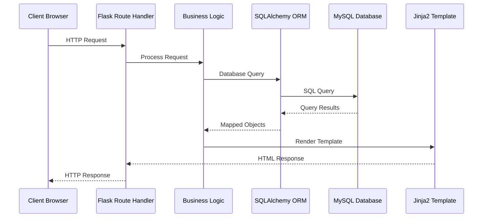
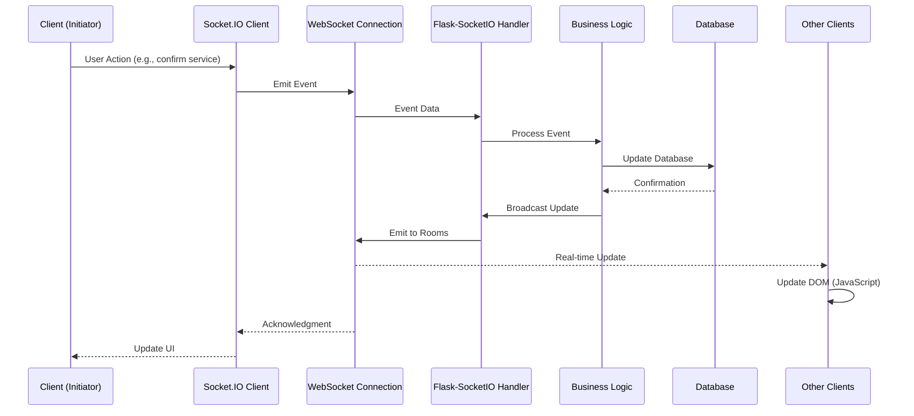
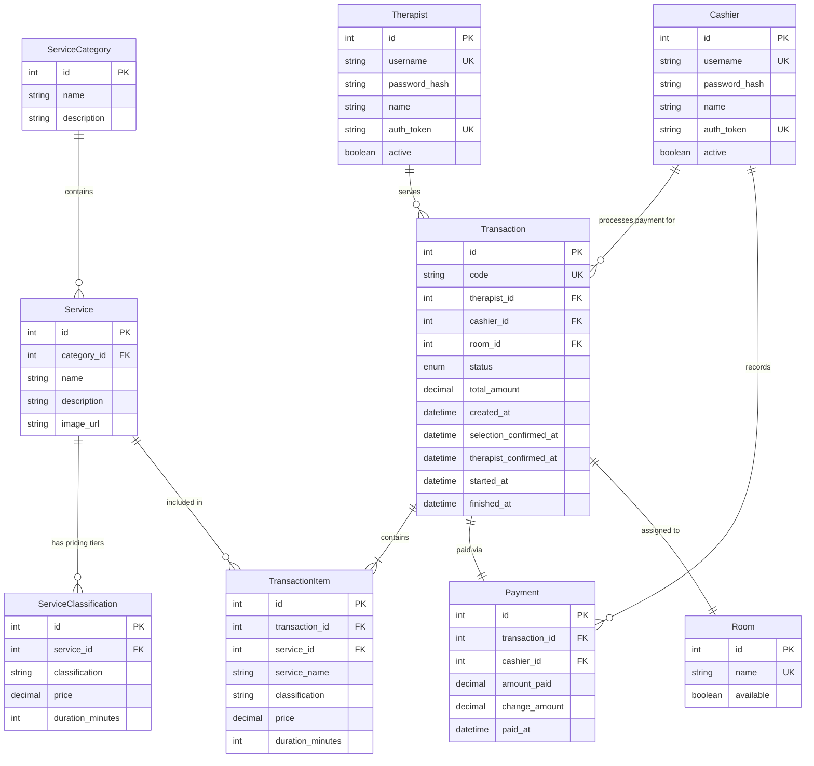
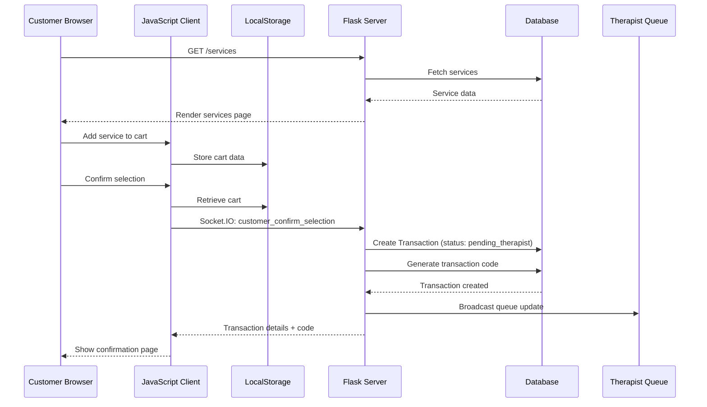
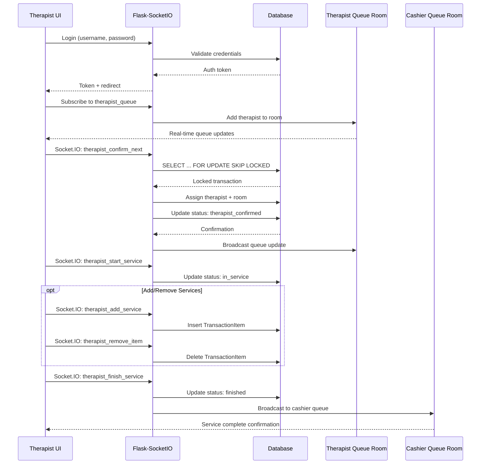
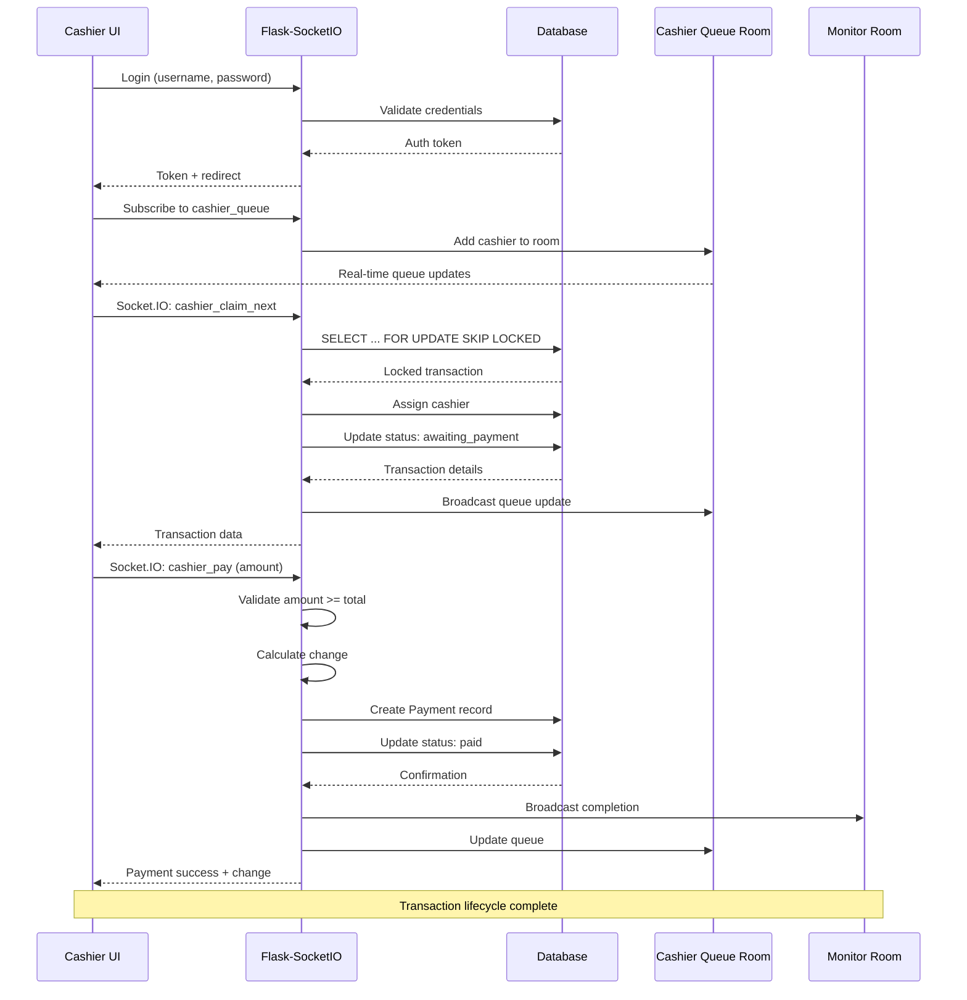

# CHAPTER 3: METHODOLOGY
## 3.3 System Architecture

### 3.3.1 Overview

The SPA Management System employs a **three-tier client-server architecture** with real-time communication capabilities, designed to facilitate concurrent multi-role operations in a spa environment. The architecture integrates a presentation layer, business logic layer, and data persistence layer, interconnected through a bidirectional event-driven communication framework.

The system architecture is built upon the **Model-View-Controller (MVC)** pattern enhanced with **WebSocket-based real-time communication**, enabling instantaneous updates across all connected clients without requiring page refreshes. This architectural approach addresses the critical requirement of maintaining synchronized state across customer, therapist, cashier, and monitor interfaces in a concurrent operational environment.

---

### 3.3.2 Architectural Pattern

#### 3.3.2.1 Three-Tier Architecture

The system implements a classical three-tier architecture with the following layers:

**1. Presentation Layer (Client Tier)**
- **Technology**: HTML5, CSS3, Vanilla JavaScript (ES6+), Socket.IO Client
- **Purpose**: User interface rendering and client-side interaction handling
- **Components**:
  - Customer service selection interface (`services1.html`, `services2.html`)
  - Therapist queue management dashboard (`therapist.html`)
  - Cashier payment processing interface (`cashier.html`)
  - Real-time monitoring dashboard (`monitor.html`)
  - Authentication interfaces (`login_therapist.html`, `login_cashier.html`)

**2. Application Layer (Business Logic Tier)**
- **Technology**: Python 3.10+, Flask 3.0.3, Flask-SocketIO 5.3.6
- **Purpose**: Business logic processing, request routing, and real-time event handling
- **Components**:
  - Flask application factory (`app/__init__.py`)
  - Blueprint-based route handlers (`routes/`)
  - Socket.IO event handlers (`socketio_events.py`)
  - Authentication middleware (`utils/auth_helpers.py`)
  - Business logic for queue management, service allocation, and payment processing

**3. Data Layer (Persistence Tier)**
- **Technology**: MySQL Database, SQLAlchemy 2.0.31 ORM, PyMySQL 1.1.1
- **Purpose**: Data persistence, integrity enforcement, and transaction management
- **Components**:
  - Relational database schema with 10 normalized tables
  - SQLAlchemy ORM models (`models.py`)
  - Database connection pooling and session management
  - ACID-compliant transaction handling

#### 3.3.2.2 MVC Pattern Implementation

The system adheres to the Model-View-Controller architectural pattern:

- **Models** (`app/models.py`): Define database entities and business domain objects including `Transaction`, `Service`, `Therapist`, `Cashier`, `Payment`, and related entities. Models encapsulate data validation, relationship management, and domain-specific methods.

- **Views** (`app/templates/`): Jinja2 template engine renders server-side HTML with dynamic content injection. Template inheritance through `base.html` ensures consistent layout and reduces code duplication.

- **Controllers** (`app/routes/`): Blueprint-based route handlers process HTTP requests, invoke business logic, and return appropriate responses. Separate blueprints for customer, therapist, cashier, monitor, and authentication concerns enable modular development.

---

### 3.3.3 System Components

#### 3.3.3.1 Core Application Components

**1. Application Factory (`app/__init__.py`)**

The application factory pattern initializes the Flask application with the following responsibilities:
- Configuration loading from environment variables
- Database connection establishment
- Socket.IO initialization with CORS configuration
- Blueprint registration for modular routing
- Database schema creation and migration

**2. Database Models (`app/models.py`)**

The data model consists of 10 interconnected entities:

| Entity | Purpose | Key Relationships |
|--------|---------|-------------------|
| `ServiceCategory` | Service categorization | One-to-Many with `Service` |
| `Service` | Service definitions | One-to-Many with `ServiceClassification`, `TransactionItem` |
| `ServiceClassification` | Service pricing tiers | Many-to-One with `Service` |
| `Therapist` | Therapist accounts | One-to-Many with `Transaction` |
| `Cashier` | Cashier accounts | One-to-Many with `Transaction`, `Payment` |
| `Transaction` | Customer transactions | One-to-Many with `TransactionItem`, One-to-One with `Payment` |
| `TransactionItem` | Individual service items | Many-to-One with `Transaction`, `Service` |
| `Payment` | Payment records | One-to-One with `Transaction` |
| `Room` | Treatment room management | One-to-One with `Transaction` |
| `TransactionCounter` | Sequential code generation | Singleton pattern for unique transaction codes |

**3. Route Blueprints (`app/routes/`)**

Modular blueprints organize functionality by user role:

- **Customer Blueprint** (`customer.py`): Service browsing and selection interfaces
- **Therapist Blueprint** (`therapist.py`): Queue management, service confirmation, and service delivery tracking
- **Cashier Blueprint** (`cashier.py`): Payment processing and transaction finalization
- **Monitor Blueprint** (`monitor.py`, `monitor_snapshot.py`): Real-time dashboard with system-wide statistics
- **Authentication Blueprint** (`auth.py`): Login, logout, and token-based authentication

**4. Socket.IO Event Handlers (`socketio_events.py`)**

Real-time bidirectional communication is managed through Socket.IO event handlers:

| Event | Trigger | Broadcast Target | Purpose |
|-------|---------|------------------|---------|
| `customer_confirm_selection` | Customer confirms services | `therapist_queue`, `monitor` | Add transaction to therapist queue |
| `therapist_confirm_next` | Therapist claims customer | `therapist_queue`, `monitor` | Assign therapist and room |
| `therapist_start_service` | Service begins | `monitor` | Update transaction status |
| `therapist_add_service` | Add service during treatment | `monitor` | Modify transaction items |
| `therapist_remove_item` | Remove service item | `monitor` | Update transaction totals |
| `therapist_finish_service` | Service completion | `cashier_queue`, `monitor` | Move to payment queue |
| `cashier_claim_next` | Cashier claims transaction | `cashier_queue`, `monitor` | Assign cashier |
| `cashier_pay` | Payment processing | `monitor`, `cashier_queue` | Complete transaction |

---

### 3.3.4 Data Flow Architecture

#### 3.3.4.1 Request-Response Flow (HTTP)

Traditional HTTP request-response cycle for page rendering and form submissions:



#### 3.3.4.2 Real-Time Event Flow (WebSocket)

Bidirectional event-driven communication for state synchronization:



#### 3.3.4.3 Concurrency Control

The system implements pessimistic locking to prevent race conditions:

**Row-Level Locking Strategy**
```python
Transaction.query
    .filter_by(status=TransactionStatus.pending_therapist)
    .order_by(Transaction.selection_confirmed_at.asc())
    .with_for_update(skip_locked=True)
    .first()
```

- `with_for_update()`: Acquires row-level lock on selected transaction
- `skip_locked=True`: Skips locked rows, preventing deadlocks
- Ensures only one therapist can claim a specific transaction
- Similar mechanism applied for cashier queue claiming

---

### 3.3.5 Communication Architecture

#### 3.3.5.1 WebSocket Communication Layer

**Technology Stack:**
- **Server**: Flask-SocketIO 5.3.6 with Eventlet 0.35.2 async mode
- **Client**: Socket.IO JavaScript client library
- **Protocol**: WebSocket with automatic fallback to long-polling

**Connection Management:**
- Persistent bidirectional connections between clients and server
- Automatic reconnection on connection loss
- Heartbeat mechanism for connection health monitoring
- Room-based broadcasting for targeted message delivery

**Room Architecture:**
- `therapist_queue`: All therapist clients subscribe for queue updates
- `cashier_queue`: All cashier clients subscribe for payment queue updates
- `monitor`: Monitoring dashboard subscribes for system-wide events
- `txn_{transaction_id}`: Per-transaction rooms for customer-specific updates

---

### 3.3.6 Database Architecture

#### 3.3.6.1 Schema Design

The database schema follows **Third Normal Form (3NF)** principles to eliminate data redundancy and ensure data integrity.

**Entity-Relationship Diagram:**



**Key Design Decisions:**

1. **Service Hierarchy**: Three-level hierarchy (Category → Service → Classification) enables flexible pricing and service variants
2. **Transaction Items**: Separate table for line items allows multiple services per transaction
3. **Audit Trail**: Timestamp fields track transaction lifecycle (created, confirmed, started, finished, paid)
4. **Soft Delete**: `active` boolean flags on Therapist and Cashier enable account deactivation without data loss
5. **Transaction Code**: Sequential 4-digit codes generated via `TransactionCounter` singleton

#### 3.3.6.2 Data Integrity Mechanisms

**1. Foreign Key Constraints**
- Enforce referential integrity between related entities
- Cascade delete for dependent records
- Prevent orphaned records

**2. Unique Constraints**
- `Transaction.code`: Ensures unique transaction identifiers
- `Therapist.username`, `Cashier.username`: Prevents duplicate accounts
- `Therapist.auth_token`, `Cashier.auth_token`: Ensures token uniqueness

**3. Enumerated Types**
- `TransactionStatus` enum enforces valid status values
- Prevents invalid state transitions at database level

**4. ACID Compliance**
- **Atomicity**: Database transactions commit or rollback as atomic units
- **Consistency**: Foreign key and check constraints maintain data consistency
- **Isolation**: Row-level locking prevents concurrent modification conflicts
- **Durability**: MySQL InnoDB engine ensures committed data persists

---

### 3.3.7 Security Architecture

#### 3.3.7.1 Authentication and Authorization

**1. Password Security**
- Passwords hashed using Werkzeug's `generate_password_hash()`
- Bcrypt-compatible algorithm with automatic salt generation
- Password verification via `check_password_hash()`
- Plain-text passwords never stored in database

**2. Token-Based Authentication**
- Session tokens generated upon successful login
- Tokens stored in browser SessionStorage
- Server-side token validation on protected routes
- Token expiration mechanism

**3. Role-Based Access Control (RBAC)**
- Separate authentication for therapist and cashier roles
- Route protection via authentication decorators
- Socket.IO event handlers validate user role before processing

#### 3.3.7.2 Input Validation and Sanitization

**1. SQL Injection Prevention**
- SQLAlchemy ORM uses parameterized queries
- User input never directly concatenated into SQL strings
- Automatic escaping of special characters

**2. Cross-Site Scripting (XSS) Prevention**
- Jinja2 auto-escaping enabled by default
- User-generated content sanitized before rendering
- MarkupSafe library ensures safe HTML output

**3. Cross-Site Request Forgery (CSRF)**
- Flask secret key for session cookie signing
- Signed cookies prevent tampering
- itsdangerous library provides cryptographic signing

---

### 3.3.8 Performance Optimization

#### 3.3.8.1 Asynchronous Processing

**Eventlet Concurrency Model:**
- Non-blocking I/O for handling multiple concurrent connections
- Greenlet-based lightweight coroutines
- Efficient context switching for I/O-bound operations
- Supports hundreds of simultaneous WebSocket connections

#### 3.3.8.2 Database Optimization

**1. Connection Pooling**
- SQLAlchemy maintains connection pool to MySQL
- Reuses connections instead of creating new ones per request

**2. Query Optimization**
- Selective column loading to reduce data transfer
- Relationship lazy loading
- Indexed columns (primary keys, foreign keys, unique constraints)

**3. Transaction Batching**
- Multiple database operations grouped into single transaction
- Reduces round-trips to database

#### 3.3.8.3 Client-Side Optimization

**1. LocalStorage Caching**
- Customer shopping cart persists in browser LocalStorage
- Reduces server requests for cart operations

**2. SessionStorage for Authentication**
- Authentication tokens stored in SessionStorage
- Reduces database lookups for authenticated requests

**3. Efficient DOM Updates**
- JavaScript updates only changed elements
- Avoids full page reloads

---

### 3.3.9 System Workflow

#### 3.3.9.1 Customer Service Selection Workflow



**Workflow Steps:**
1. Customer accesses service selection page
2. JavaScript loads services from server (HTTP GET)
3. Customer adds services to cart (LocalStorage)
4. Customer confirms selection
5. JavaScript emits Socket.IO event with cart data
6. Server creates Transaction with status "pending_therapist"
7. Server generates unique transaction code
8. Server broadcasts update to therapist queue
9. Server sends transaction details back to customer
10. Customer sees confirmation with transaction code

#### 3.3.9.2 Therapist Service Delivery Workflow



**Workflow Steps:**
1. Therapist logs in (token-based authentication)
2. Therapist subscribes to "therapist_queue" room
3. Therapist views pending customers (real-time updates)
4. Therapist clicks "Confirm Next Customer"
5. Server locks next pending transaction (row-level lock)
6. Server assigns therapist and room to transaction
7. Server updates status to "therapist_confirmed"
8. Server broadcasts queue update to all therapists
9. Therapist starts service (status: "in_service")
10. Therapist can add/remove services during treatment
11. Therapist finishes service (status: "finished")
12. Transaction moves to cashier queue

#### 3.3.9.3 Cashier Payment Processing Workflow



**Workflow Steps:**
1. Cashier logs in (token-based authentication)
2. Cashier subscribes to "cashier_queue" room
3. Cashier views finished transactions (real-time updates)
4. Cashier clicks "Claim Next Customer"
5. Server locks next finished transaction (row-level lock)
6. Server assigns cashier to transaction
7. Server updates status to "awaiting_payment"
8. Cashier enters payment amount
9. Server validates payment (amount >= total)
10. Server calculates change
11. Server creates Payment record
12. Server updates status to "paid"
13. Server broadcasts completion to monitor
14. Transaction lifecycle complete

---

### 3.3.10 Technology Justification

#### 3.3.10.1 Backend Technology Selection

**Flask Framework:**
- Lightweight micro-framework ideal for medium-sized applications
- Minimal boilerplate, flexible architecture
- Easy learning curve and rapid development

**Flask-SocketIO:**
- Critical for real-time queue management and status synchronization
- Seamless Flask integration
- Automatic fallback mechanisms
- Room-based broadcasting

**SQLAlchemy ORM:**
- Pythonic database interactions with database-agnostic code
- Relationship management, query building
- SQL injection prevention

**MySQL Database:**
- ACID compliance essential for payment processing
- Robust transaction support
- Foreign key constraints for data integrity

#### 3.3.10.2 Frontend Technology Selection

**Vanilla JavaScript:**
- Sufficient for required interactivity without framework overhead
- Fast page loads, direct DOM control
- No build process required

**Jinja2 Templates:**
- Native Flask integration with powerful template inheritance
- Server-side rendering
- XSS prevention through auto-escaping

#### 3.3.10.3 Concurrency Model Selection

**Eventlet Async Mode:**
- Non-blocking I/O essential for handling multiple concurrent WebSocket connections
- Lightweight coroutines
- Efficient context switching
- Proven scalability

---

### 3.3.11 Architecture Diagram

```
┌─────────────────────────────────────────────────────────────────┐
│                        CLIENT TIER                               │
│  ┌──────────┐  ┌──────────┐  ┌──────────┐  ┌──────────┐       │
│  │ Customer │  │Therapist │  │ Cashier  │  │ Monitor  │       │
│  │   UI     │  │    UI    │  │    UI    │  │    UI    │       │
│  └────┬─────┘  └────┬─────┘  └────┬─────┘  └────┬─────┘       │
│       │             │              │              │              │
│       └─────────────┴──────────────┴──────────────┘              │
│                          │                                        │
│                    HTTP/WebSocket                                │
└──────────────────────────┼──────────────────────────────────────┘
                           │
┌──────────────────────────┼──────────────────────────────────────┐
│                   APPLICATION TIER                               │
│                          │                                        │
│  ┌───────────────────────▼────────────────────────┐             │
│  │         Flask Application (WSGI)                │             │
│  │  ┌──────────────────────────────────────────┐  │             │
│  │  │        Flask-SocketIO (Eventlet)         │  │             │
│  │  └──────────────────────────────────────────┘  │             │
│  │  ┌──────────┐  ┌──────────┐  ┌──────────┐    │             │
│  │  │ Customer │  │Therapist │  │ Cashier  │    │             │
│  │  │Blueprint │  │Blueprint │  │Blueprint │    │             │
│  │  └──────────┘  └──────────┘  └──────────┘    │             │
│  │  ┌──────────┐  ┌──────────────────────────┐  │             │
│  │  │  Auth    │  │   Socket.IO Events       │  │             │
│  │  │Blueprint │  │   (Real-time Handlers)   │  │             │
│  │  └──────────┘  └──────────────────────────┘  │             │
│  └───────────────────────┬────────────────────────┘             │
│                          │                                        │
│                    SQLAlchemy ORM                                │
└──────────────────────────┼──────────────────────────────────────┘
                           │
┌──────────────────────────┼──────────────────────────────────────┐
│                      DATA TIER                                   │
│                          │                                        │
│  ┌───────────────────────▼────────────────────────┐             │
│  │              MySQL Database                     │             │
│  │  ┌──────────────────────────────────────────┐  │             │
│  │  │  Service Tables                          │  │             │
│  │  │  - ServiceCategory                       │  │             │
│  │  │  - Service                               │  │             │
│  │  │  - ServiceClassification                 │  │             │
│  │  └──────────────────────────────────────────┘  │             │
│  │  ┌──────────────────────────────────────────┐  │             │
│  │  │  Transaction Tables                      │  │             │
│  │  │  - Transaction                           │  │             │
│  │  │  - TransactionItem                       │  │             │
│  │  │  - TransactionCounter                    │  │             │
│  │  └──────────────────────────────────────────┘  │             │
│  │  ┌──────────────────────────────────────────┐  │             │
│  │  │  User Tables                             │  │             │
│  │  │  - Therapist                             │  │             │
│  │  │  - Cashier                               │  │             │
│  │  └──────────────────────────────────────────┘  │             │
│  │  ┌──────────────────────────────────────────┐  │             │
│  │  │  Supporting Tables                       │  │             │
│  │  │  - Payment                               │  │             │
│  │  │  - Room                                  │  │             │
│  │  └──────────────────────────────────────────┘  │             │
│  └─────────────────────────────────────────────────┘             │
└──────────────────────────────────────────────────────────────────┘
```

---

### 3.3.12 Summary

The SPA Management System architecture implements a robust three-tier client-server model enhanced with real-time bidirectional communication capabilities. The architecture successfully addresses the core requirements of concurrent multi-role operations, queue management, and payment processing in a spa environment.

**Key Architectural Strengths:**

1. **Separation of Concerns**: Clear delineation between presentation, business logic, and data layers facilitates maintainability and testing.

2. **Real-Time Synchronization**: WebSocket-based communication ensures all connected clients maintain consistent state without manual refreshes.

3. **Concurrency Safety**: Row-level locking mechanisms prevent race conditions in multi-user queue claiming scenarios.

4. **Scalability**: Modular blueprint architecture and stateless design enable future horizontal scaling.

5. **Security**: Multi-layered security approach including password hashing, token-based authentication, SQL injection prevention, and XSS protection.

6. **Performance**: Asynchronous I/O processing, database connection pooling, and client-side caching optimize system responsiveness.

The architecture demonstrates industry-standard design patterns and best practices, providing a solid foundation for a production-ready spa management solution.
