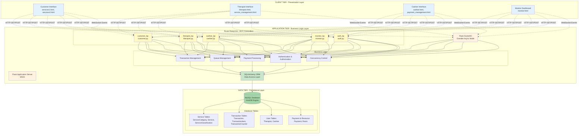

# CHAPTER 3: METHODOLOGY - SYSTEM ARCHITECTURE (MERMAID DIAGRAMS)

## Purpose
This document provides comprehensive Mermaid diagrams with detailed descriptions based on your actual Flask SPA Management System for your Chapter 3 Methodology thesis.

---

## 1. High-Level Three-Tier System Architecture



### Detailed Description:

The SPA Management System implements a **three-tier client-server architecture** with clear separation of concerns:

**CLIENT TIER:** Four role-specific interfaces (Customer, Therapist, Cashier, Monitor) built with HTML5/CSS3/JavaScript and Socket.IO client for real-time updates. Customer interface uses LocalStorage for cart persistence.

**APPLICATION TIER:** Flask 3.0.3 with MVC pattern through blueprints (customer.py, therapist.py, cashier.py, monitor.py, auth.py). Flask-SocketIO 5.3.6 with Eventlet async mode handles WebSocket connections. Business logic layer manages transactions, queues, payments, authentication, and concurrency control using row-level locking. SQLAlchemy ORM provides database abstraction.

**DATA TIER:** MySQL with InnoDB engine ensures ACID compliance. Schema follows 3NF with 10 normalized tables organized into Service Tables (catalog management), Transaction Tables (customer journey tracking), User Tables (authentication), and Payment/Resource Tables (financial records and room management).

---

## OLD DIAGRAM BELOW - REPLACE WITH MERMAID

```
CLIENT TIER (Presentation Layer)
┌────────────┐  ┌────────────┐  ┌────────────┐  ┌────────────┐
│  Customer  │  │ Therapist  │  │  Cashier   │  │  Monitor   │
│ Interface  │  │ Interface  │  │ Interface  │  │ Dashboard  │
└─────┬──────┘  └─────┬──────┘  └─────┬──────┘  └─────┬──────┘
      └───────────────┴────────────────┴────────────────┘
                       │ HTTP/HTTPS + WebSocket
                       ▼
APPLICATION TIER (Business Logic Layer)
┌─────────────────────────────────────────────────────────────┐
│  Flask Application Server (WSGI)                            │
│  ├─ Flask-SocketIO (Eventlet) - Real-time Communication    │
│  ├─ Route Blueprints (MVC Controllers)                     │
│  ├─ Business Logic (Transaction, Queue, Payment Mgmt)      │
│  └─ SQLAlchemy ORM (Data Access Layer)                     │
└──────────────────────────┬──────────────────────────────────┘
                           │ SQL Queries
                           ▼
DATA TIER (Persistence Layer)
┌─────────────────────────────────────────────────────────────┐
│  MySQL Database (InnoDB Engine)                             │
│  • 10 Normalized Tables (3NF)                               │
│  • ACID Compliance, Foreign Key Constraints                 │
│  • Row-level Locking for Concurrency Control                │
└─────────────────────────────────────────────────────────────┘
```

**Academic Description:** The system implements a three-tier client-server architecture with clear separation between presentation, business logic, and data persistence (Sommerville, 2016). The Client Tier provides role-specific interfaces using HTML5/CSS3/JavaScript with Socket.IO for real-time updates. The Application Tier uses Flask 3.0.3 with MVC pattern through blueprints, Flask-SocketIO 5.3.6 for WebSocket support, and Eventlet for non-blocking I/O. The Data Tier employs MySQL with InnoDB engine ensuring ACID compliance and Third Normal Form (3NF) schema design.

---

## 2. Transaction Lifecycle State Machine

```
START → SELECTING → PENDING_THERAPIST → THERAPIST_CONFIRMED → 
IN_SERVICE → FINISHED → AWAITING_PAYMENT → PAYING → PAID → END

State Details:
─────────────
SELECTING
• Cart in LocalStorage, no DB record

PENDING_THERAPIST
• Transaction created, code generated (0001-9999)
• Broadcast to therapist_queue
• Timestamp: selection_confirmed_at

THERAPIST_CONFIRMED
• Therapist & room assigned via row-level lock
• Timestamp: therapist_confirmed_at

IN_SERVICE
• Service active, items modifiable
• Timestamp: service_start_at

FINISHED
• Service complete, broadcast to cashier_queue
• Timestamp: service_finish_at

AWAITING_PAYMENT
• Cashier assigned via row-level lock
• Timestamp: cashier_claimed_at

PAYING
• Payment validation & change calculation

PAID
• Payment record created
• Timestamp: paid_at
• Transaction complete
```

**Academic Description:** The transaction lifecycle implements a finite state machine (FSM) with eight states enforced through `TransactionStatus` enum (Hopcroft et al., 2006). Timestamps at each transition provide complete audit trail. Concurrency control uses MySQL's `SELECT ... FOR UPDATE SKIP LOCKED` for pessimistic locking, preventing race conditions when multiple users claim transactions simultaneously (Bernstein & Newcomer, 2009).

---

## 3. Real-Time Communication Architecture

```
[Customer] [Therapist] [Cashier] [Monitor]
     │          │          │         │
     └──────────┴──────────┴─────────┘
                │ WebSocket (Persistent)
                ▼
┌───────────────────────────────────────────────┐
│  Flask-SocketIO Server (Eventlet Async)      │
│                                               │
│  Room Manager (Publish-Subscribe):           │
│  ├─ therapist_queue (all therapists)         │
│  ├─ cashier_queue (all cashiers)             │
│  ├─ monitor (all monitors)                   │
│  └─ txn_{id} (per-customer)                  │
│                                               │
│  Event Handlers:                             │
│  • customer_confirm_selection                │
│  • therapist_confirm_next                    │
│  • therapist_start/finish_service            │
│  • cashier_claim_next, cashier_pay           │
└───────────────┬───────────────────────────────┘
                ▼
        Business Logic & Database
```

**Academic Description:** Event-driven architecture using WebSocket protocol (RFC 6455) for bidirectional real-time communication (Fette & Melnikov, 2011). Implements publish-subscribe pattern through Socket.IO rooms (Eugster et al., 2003). Eventlet async mode uses greenlet-based coroutines for non-blocking I/O, efficiently handling hundreds of concurrent connections (Beazley & Jones, 2013). Room-based broadcasting ensures targeted message delivery, minimizing network traffic.

---

## 4. Database Entity-Relationship Diagram

```
ServiceCategory (1) ──< (N) Service (1) ──< (N) ServiceClassification
                              │
                              └──< (N) TransactionItem (N) >── (1) Transaction
                                                                      │
                                    ┌─────────────────────────────────┤
                                    │                                 │
                            (1) Payment                         (N) Therapist
                                    │                           (N) Cashier
                            (1) Cashier                         (1) Room

Key Entities:
────────────
Transaction: id, code(UK), status(ENUM), therapist_id(FK), 
             cashier_id(FK), room_number, total_amount,
             timestamps (created_at, selection_confirmed_at,
             therapist_confirmed_at, service_start_at,
             service_finish_at, cashier_claimed_at, paid_at)

TransactionItem: id, transaction_id(FK), service_id(FK),
                 service_classification_id(FK), price, duration

Service: id, category_id(FK), service_name, description

ServiceClassification: id, service_id(FK), classification_name,
                       price, duration_minutes

Therapist/Cashier: id, username(UK), password_hash, name,
                   auth_token(UK), active

Payment: id, transaction_id(FK,UK), cashier_id(FK),
         amount_due, amount_paid, change_amount

TransactionCounter: id, next_number (Singleton for code generation)
```

**Academic Description:** Schema follows Third Normal Form (3NF) eliminating data redundancy (Codd, 1970). Three-level service hierarchy (Category→Service→Classification) enables flexible pricing. Transaction entity serves as central hub with comprehensive timestamp fields for audit trail. Foreign key constraints enforce referential integrity. TransactionCounter singleton generates sequential 4-digit codes. Unique constraints on usernames and auth tokens prevent duplicates.

---

## 5. Deployment Architectures

### Development Environment
```
Developer Machine (localhost)
├─ Browser (multiple tabs for role simulation)
├─ Python Virtual Environment
│  └─ Flask App (port 5000) + Flask-SocketIO + Eventlet
├─ XAMPP Stack
│  ├─ MySQL Server (port 3306)
│  └─ phpMyAdmin (database GUI)
└─ File System (project code, .env, static files)
```

### Production Environment (Recommended)
```
Client Devices → Nginx (SSL/Load Balancer)
                    ↓
        ┌───────────┴───────────┐
        ↓                       ↓
   Flask Server 1          Flask Server 2
   (Gunicorn+Eventlet)     (Gunicorn+Eventlet)
        └───────────┬───────────┘
                    ↓
            Redis (Socket.IO Adapter)
                    ↓
        ┌───────────┴───────────┐
        ↓                       ↓
   MySQL Primary           MySQL Replica
   (Read/Write)            (Read Only)
```

**Academic Description:** Development uses local XAMPP for MySQL with Flask on port 5000. Production implements high availability: Nginx handles SSL termination and load balancing, multiple Flask servers with Gunicorn+Eventlet workers, Redis for Socket.IO message broadcasting across servers, and MySQL primary-replica configuration for read scalability.

---

## 6. Security Architecture

```
Security Layers:
───────────────
1. Transport Security
   • HTTPS/TLS 1.3, WebSocket Secure (wss://)

2. Authentication & Authorization
   • Password hashing (Werkzeug bcrypt-compatible)
   • Token-based auth (SessionStorage)
   • Role-based Access Control (RBAC)

3. Input Validation
   • Client-side JavaScript validation
   • Server-side Python validation
   • Jinja2 auto-escaping (XSS prevention)
   • SQLAlchemy parameterized queries (SQL injection prevention)

4. Session Management
   • Flask signed sessions (itsdangerous)
   • Token expiration mechanism

5. Database Security
   • Foreign key constraints
   • Row-level locking
   • ACID transactions
```

**Academic Description:** Multi-layered security approach: Transport layer uses TLS 1.3 encryption. Authentication layer implements Werkzeug password hashing and token-based auth with expiration. Input validation prevents XSS through Jinja2 auto-escaping and SQL injection through SQLAlchemy parameterized queries. Session management uses cryptographic signing (itsdangerous). Database enforces integrity through foreign key constraints and ACID transactions.

---

## 7. Concurrency Control Mechanism

```
Scenario: Two therapists click "Confirm Next" simultaneously

Therapist 1                    Therapist 2
    │                              │
    ├─ BEGIN TRANSACTION           ├─ BEGIN TRANSACTION
    │                              │
    ├─ SELECT ... FOR UPDATE       ├─ SELECT ... FOR UPDATE
    │  SKIP LOCKED                 │  SKIP LOCKED
    │                              │
    ├─ Acquires lock on Txn #0001  ├─ Txn #0001 locked, skips to #0002
    │                              │
    ├─ UPDATE Txn #0001            ├─ UPDATE Txn #0002
    │  SET therapist_id=T1         │  SET therapist_id=T2
    │                              │
    ├─ COMMIT                      ├─ COMMIT
    │                              │
    └─ Assigned Txn #0001          └─ Assigned Txn #0002

Result: No race condition, each gets different transaction
```

**Academic Description:** Pessimistic locking using `SELECT ... FOR UPDATE SKIP LOCKED` prevents race conditions. When multiple users claim transactions simultaneously, each acquires row-level lock on different transactions. `SKIP LOCKED` clause skips locked rows, eliminating deadlocks while ensuring exactly-once assignment (Bernstein & Newcomer, 2009).

---

## References

- Bernstein, P. A., & Newcomer, E. (2009). *Principles of Transaction Processing*. Morgan Kaufmann.
- Beazley, D., & Jones, B. K. (2013). *Python Cookbook*. O'Reilly Media.
- Codd, E. F. (1970). A relational model of data for large shared data banks. *Communications of the ACM*, 13(6), 377-387.
- Eugster, P. T., et al. (2003). The many faces of publish/subscribe. *ACM Computing Surveys*, 35(2), 114-131.
- Fette, I., & Melnikov, A. (2011). *The WebSocket Protocol* (RFC 6455). IETF.
- Fowler, M. (2002). *Patterns of Enterprise Application Architecture*. Addison-Wesley.
- Hopcroft, J. E., et al. (2006). *Introduction to Automata Theory, Languages, and Computation*. Pearson.
- Sommerville, I. (2016). *Software Engineering* (10th ed.). Pearson.

---

## Usage Instructions

Include these diagrams in your Chapter 3 Methodology thesis under the "System Architecture" section. Each diagram is accompanied by an academic description suitable for thesis documentation. Cross-reference with your existing `CHAPTER_3_SYSTEM_ARCHITECTURE.md` for comprehensive coverage.
