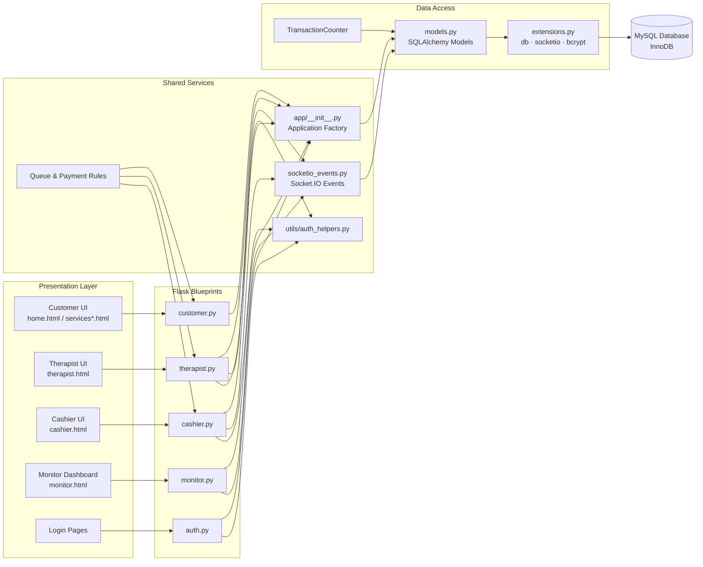

# Component Architecture Diagram

## Flask SPA Management System - Component View

## Academic Description

The revised component diagram highlights four logical tiers to clarify responsibilities. The **presentation layer** contains the role-specific Jinja templates and JavaScript that users interact with. These interfaces route requests to matching **Flask blueprints** (`customer.py`, `therapist.py`, `cashier.py`, `monitor.py`, `auth.py`), which act as controllers for each role.

Shared services sit behind the controllers. The application factory (`app/__init__.py`) registers blueprints and extensions, `socketio_events.py` delivers the real-time Socket.IO handlers, `utils/auth_helpers.py` centralizes token validation, and the domain-specific business rules coordinate queue and payment logic used by multiple roles.

Within the data access layer, SQLAlchemy models in `models.py` depend on the configured extensions (`extensions.py`) to communicate with the MySQL database, while `TransactionCounter` guarantees unique customer-facing codes. This layered structure makes the flow from user interface to persistence easy to trace, reinforcing separation of concerns and improving maintainability.
