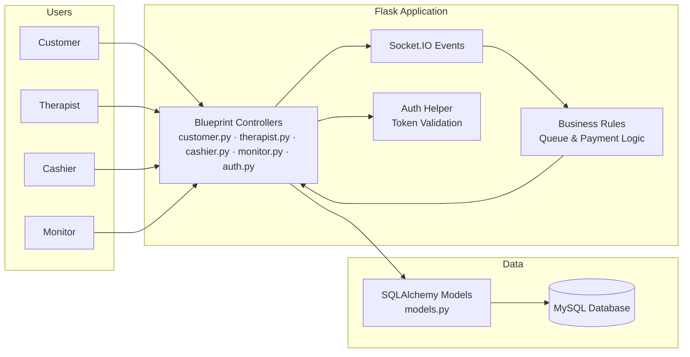

# Component Architecture Diagram (Simplified)

## Flask SPA Management System - Simplified Component View

## Description

This simplified component diagram shows how the system fits together without detailed technical layers. Users access the system through role-specific Flask blueprints (`customer.py`, `therapist.py`, `cashier.py`, `monitor.py`, `auth.py`). These controllers coordinate with Socket.IO events for real-time updates, business rule functions for queue and payment processing, and a shared authentication helper for token validation. Data persistence relies on SQLAlchemy models defined in `models.py`, which store and retrieve information from the MySQL database. This view highlights the main building blocks while keeping the structure easy to understand for presentations and summaries.
