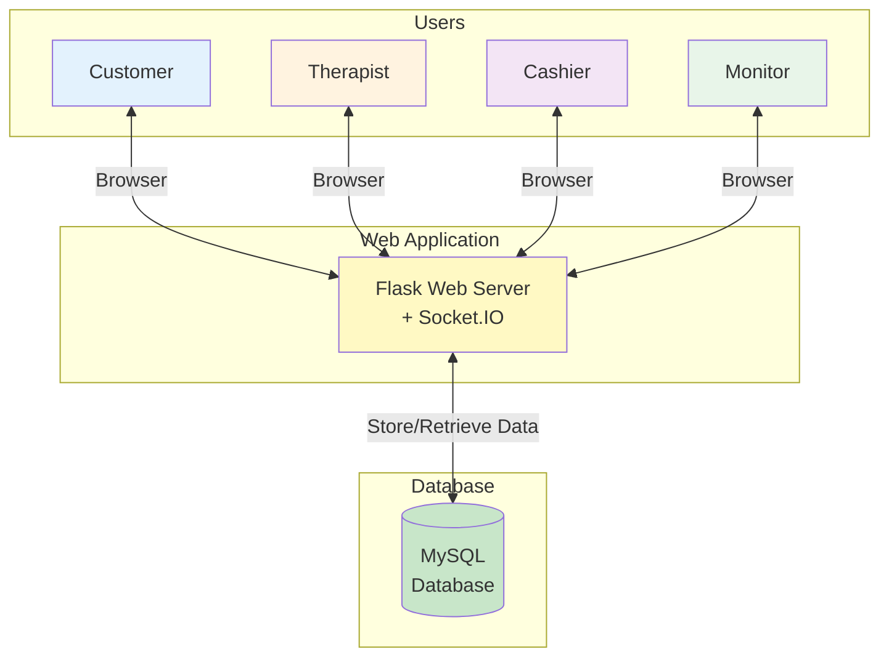
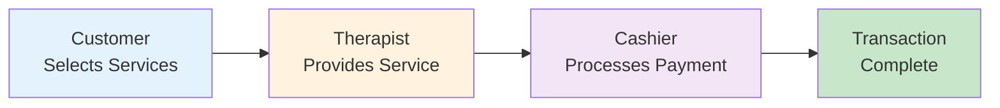
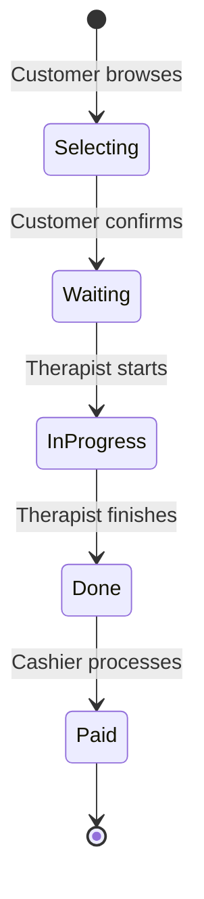
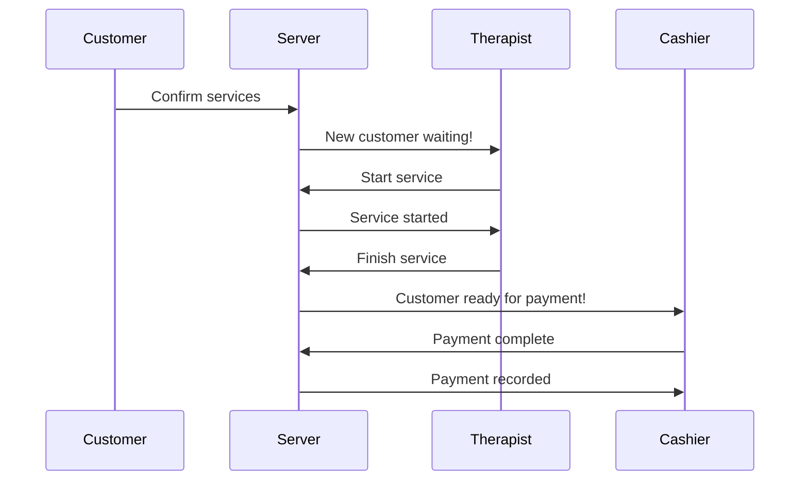
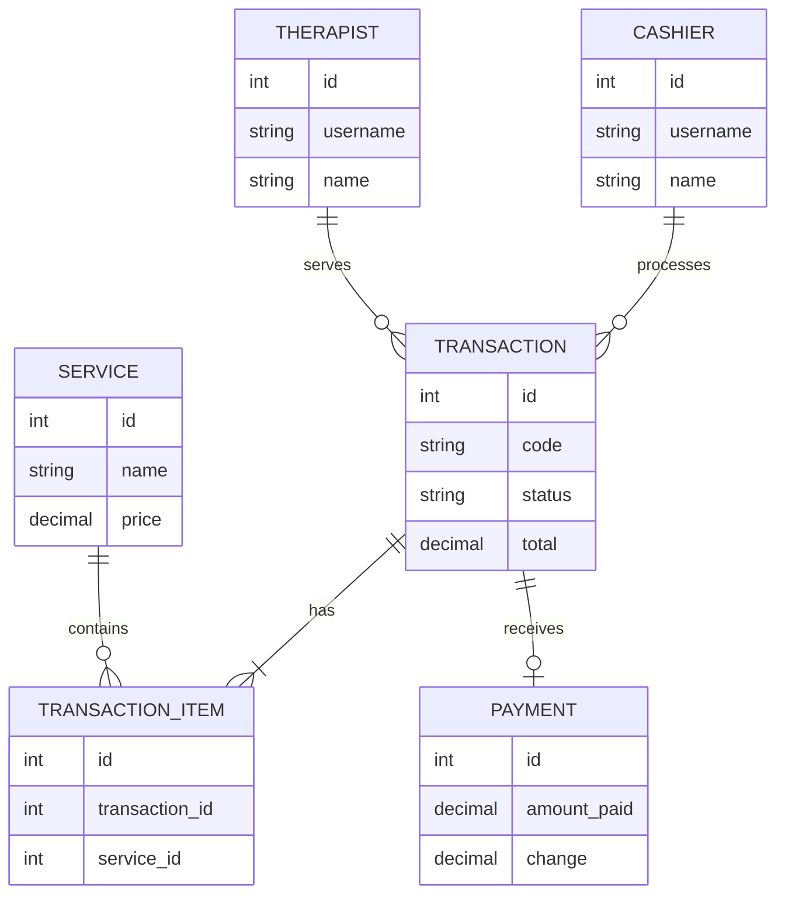
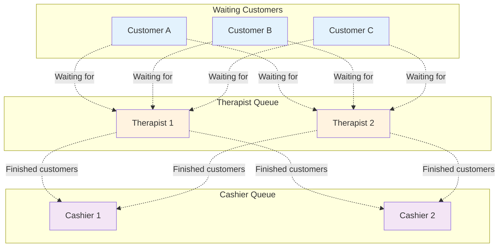
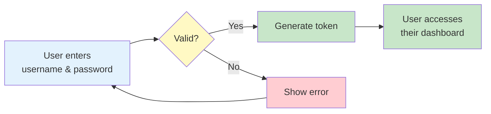
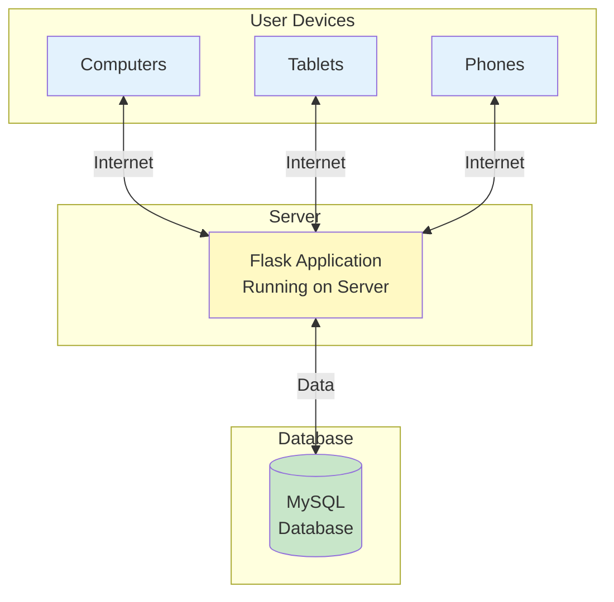

# CHAPTER 3: METHODOLOGY - SIMPLIFIED SYSTEM ARCHITECTURE DIAGRAMS

Simplified Mermaid diagrams for easier understanding - perfect for thesis presentations.

---

## 1. System Architecture Overview

### Description:

The system has **three main parts**: Users access the system through web browsers, a Flask web server handles all requests and real-time updates via Socket.IO, and a MySQL database stores all information. This simple architecture allows multiple users to interact with the system simultaneously.

---

## 2. Transaction Flow (Customer Journey)

### Description:

A customer's journey has **three simple steps**: First, the customer selects services. Second, a therapist provides the service. Third, a cashier processes the payment. Each step updates the system in real-time so everyone sees the current status.

---

## 3. Transaction States

### Description:

Every transaction goes through **5 main states**: Selecting (customer choosing services), Waiting (waiting for therapist), InProgress (service being provided), Done (service finished), and Paid (payment completed). The system tracks which state each transaction is in.

---

## 4. Real-Time Updates

### Description:

The system uses **real-time communication** so everyone sees updates instantly. When a customer confirms services, therapists immediately see a new customer. When a therapist finishes, cashiers immediately see a customer ready for payment. No page refresh needed!

---

## 5. Database Tables (Simplified)

### Description:

The database has **6 main tables**: Services (available services), Therapists (staff providing services), Cashiers (staff processing payments), Transactions (customer orders), Transaction Items (services in each order), and Payments (payment records). Tables are connected through relationships.

---

## 6. How Multiple Users Work Together

### Description:

The system manages **queues** automatically. Multiple customers can wait for available therapists. When therapists finish services, customers move to the cashier queue. The system prevents two therapists from claiming the same customer using database locking.

---

## 7. User Authentication

### Description:

**Security** is simple: Therapists and cashiers log in with username and password. Passwords are encrypted (hashed) in the database. After successful login, the system creates a secure token that expires after 24 hours. Users must log in again after the token expires.

---

## 8. System Deployment

### Description:

The system can be accessed from **any device** with a web browser (computers, tablets, phones). All devices connect to a central Flask server through the internet. The server communicates with the MySQL database to store and retrieve information. This setup allows staff to work from different locations in the spa.

---

## Key System Features Summary

### 1. **Real-Time Updates**
- No page refresh needed
- Everyone sees changes instantly
- Uses WebSocket technology (Socket.IO)

### 2. **Queue Management**
- Automatic customer queuing
- Prevents double-booking
- Fair first-come-first-served system

### 3. **Role-Based Access**
- Customers: Browse and select services
- Therapists: View queue, provide services
- Cashiers: Process payments
- Monitor: View all activities

### 4. **Data Integrity**
- All transactions recorded in database
- Complete history with timestamps
- Secure password storage

### 5. **Concurrent Operations**
- Multiple users can work simultaneously
- Database locking prevents conflicts
- Scalable to many users

---

## Technology Stack (Simple Version)

| Component | Technology | Purpose |
|-----------|-----------|---------|
| **Frontend** | HTML, CSS, JavaScript | User interface |
| **Backend** | Python Flask | Web server |
| **Real-time** | Socket.IO | Live updates |
| **Database** | MySQL | Data storage |
| **Security** | Password hashing, Tokens | User authentication |

---

## How It All Works Together

1. **Customer** opens website and selects services → Stored in database
2. **System** broadcasts update → Therapists see new customer in queue
3. **Therapist** claims customer → Database locks transaction to prevent duplicates
4. **Therapist** provides service → Can add/remove services during treatment
5. **Therapist** finishes → System broadcasts to cashiers
6. **Cashier** claims transaction → Database locks to prevent duplicates
7. **Cashier** processes payment → Calculates change automatically
8. **System** marks transaction complete → Room becomes available
9. **Monitor** dashboard shows all activities in real-time

---

## Benefits of This Architecture

✅ **Simple to Use** - Intuitive interface for all users  
✅ **Fast** - Real-time updates without delays  
✅ **Reliable** - Database ensures no data loss  
✅ **Secure** - Encrypted passwords and token authentication  
✅ **Scalable** - Can handle many concurrent users  
✅ **Maintainable** - Clear separation of concerns  

---

## References

- Sommerville, I. (2016). *Software Engineering* (10th ed.). Pearson.
- Fowler, M. (2002). *Patterns of Enterprise Application Architecture*. Addison-Wesley.
