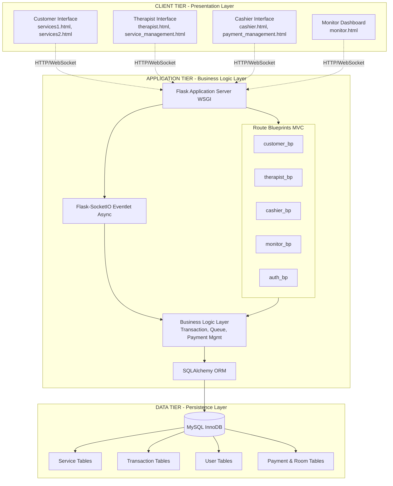
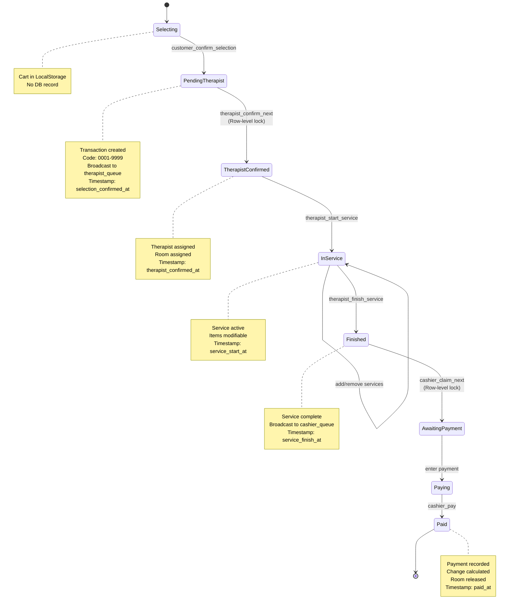
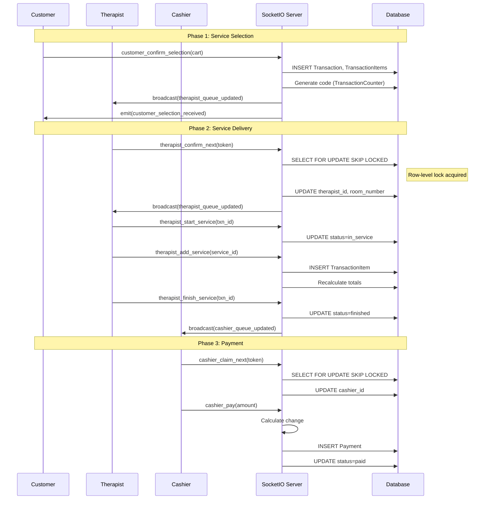
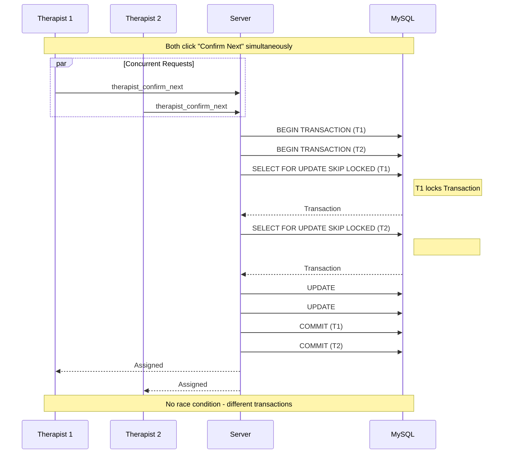
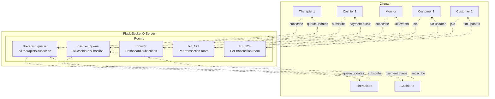
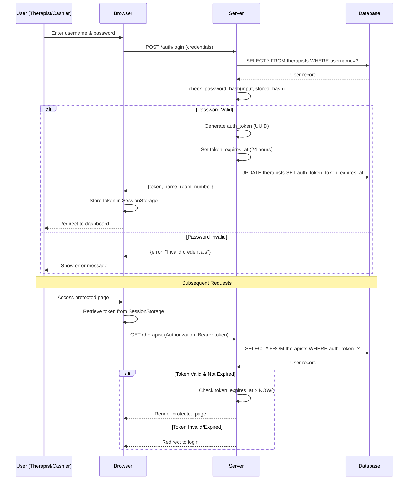
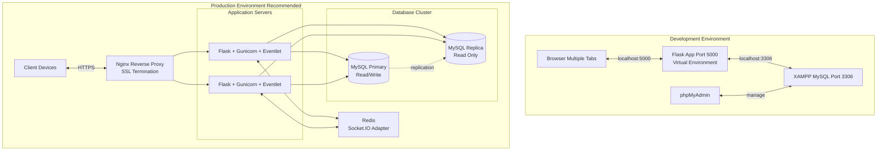

# CHAPTER 3: METHODOLOGY - SYSTEM ARCHITECTURE DIAGRAMS (MERMAID)

Complete set of Mermaid diagrams with detailed descriptions for your thesis Chapter 3 System Architecture section.

---

## 1. Three-Tier System Architecture



### Description:

The system implements a **three-tier architecture** separating presentation (4 role-specific interfaces), business logic (Flask with blueprints, Socket.IO for real-time communication, SQLAlchemy ORM), and data persistence (MySQL with 10 normalized tables). This architecture enables independent development, testing, and scaling of each tier while maintaining clear separation of concerns.

---

## 2. Transaction Lifecycle State Machine



### Description:

The transaction follows an **8-state finite state machine** enforced by `TransactionStatus` enum. Each transition is triggered by Socket.IO events and records timestamps for audit trail. Concurrency control uses `SELECT ... FOR UPDATE SKIP LOCKED` at therapist and cashier claiming stages to prevent race conditions. Services can be dynamically added/removed during the InService state, with automatic total recalculation.

---

## 3. Real-Time Communication Flow



### Description:

Real-time communication uses **WebSocket protocol** via Flask-SocketIO with room-based broadcasting. The system implements **publish-subscribe pattern** with rooms: `therapist_queue` (all therapists), `cashier_queue` (all cashiers), `monitor` (dashboard). Concurrency control prevents double-assignment through pessimistic locking with `SKIP LOCKED` clause. All state changes broadcast to relevant subscribers for sub-second synchronization.

---

## 4. Database Entity-Relationship Diagram

```mermaid
erDiagram
    ServiceCategory ||--o{ Service : contains
    Service ||--o{ ServiceClassification : "has tiers"
    Service ||--o{ TransactionItem : "included in"
    ServiceClassification ||--o{ TransactionItem : "pricing"
    
    Therapist ||--o{ Transaction : serves
    Cashier ||--o{ Transaction : "processes"
    Cashier ||--o{ Payment : records
    
    Transaction ||--|{ TransactionItem : contains
    Transaction ||--o| Payment : "paid via"
    Transaction ||--o| Room : "uses"
    
    ServiceCategory {
        int id PK
        string category_name UK
    }
    
    Service {
        int id PK
        int category_id FK
        string service_name
        string description
    }
    
    ServiceClassification {
        int id PK
        int service_id FK
        string classification_name
        decimal price
        int duration_minutes
    }
    
    Therapist {
        int id PK
        string username UK
        string password_hash
        string name
        string room_number
        boolean active
        string auth_token UK
        datetime token_expires_at
    }
    
    Cashier {
        int id PK
        string username UK
        string password_hash
        string name
        string counter_number
        boolean active
        string auth_token UK
        datetime token_expires_at
    }
    
    Transaction {
        int id PK
        string code UK
        enum status
        int therapist_id FK
        int assigned_cashier_id FK
        string room_number
        decimal total_amount
        int total_duration_minutes
        datetime created_at
        datetime selection_confirmed_at
        datetime therapist_confirmed_at
        datetime service_start_at
        datetime service_finish_at
        datetime cashier_claimed_at
        datetime paid_at
    }
    
    TransactionItem {
        int id PK
        int transaction_id FK
        int service_id FK
        int service_classification_id FK
        decimal price
        int duration_minutes
    }
    
    Payment {
        int id PK
        int transaction_id FK_UK
        int cashier_id FK
        decimal amount_due
        decimal amount_paid
        decimal change_amount
        string method
        datetime created_at
    }
    
    Room {
        int id PK
        string room_number UK
        string status
        int current_transaction_id FK
    }
```

### Description:

The database follows **Third Normal Form (3NF)** with 10 entities. **Service hierarchy** (Category→Service→Classification) enables flexible pricing tiers. **Transaction** entity is the central hub with 7 timestamps providing complete audit trail. **Denormalized fields** in TransactionItem (price, duration) preserve historical accuracy. **Soft delete** pattern on user tables maintains referential integrity. **Foreign key constraints** enforce data integrity. **TransactionCounter** singleton generates unique 4-digit codes.

---

## 5. Concurrency Control Mechanism



### Description:

**Pessimistic locking** prevents race conditions using MySQL's `SELECT ... FOR UPDATE SKIP LOCKED`. When multiple users claim transactions simultaneously, each acquires row-level lock on different transactions. The `SKIP LOCKED` clause instructs database to skip locked rows, automatically moving to next available transaction. This eliminates deadlocks while ensuring exactly-once assignment. Same mechanism applies to cashier queue claiming.

---

## 6. WebSocket Room Architecture



### Description:

**Room-based broadcasting** implements publish-subscribe pattern for targeted message delivery. **Global rooms**: `therapist_queue` receives queue updates, `cashier_queue` receives payment queue updates, `monitor` receives all system events. **Per-transaction rooms**: `txn_{id}` for customer-specific updates. Clients subscribe to relevant rooms based on role. This architecture minimizes network traffic by broadcasting only to interested parties, enabling efficient real-time synchronization across hundreds of concurrent connections.

---

## 7. Authentication & Authorization Flow



### Description:

**Token-based authentication** secures therapist and cashier interfaces. Passwords are hashed using Werkzeug's bcrypt-compatible algorithm. Upon successful login, server generates unique auth token (UUID) with 24-hour expiration, stored in database and browser SessionStorage. Protected routes validate token on each request by querying database and checking expiration. **Hybrid authentication** supports both token (primary) and session (fallback) for flexibility. Tokens are unique per user (database constraint) preventing token reuse.

---

## 8. Deployment Architecture



### Description:

**Development**: Local setup with Flask on port 5000, XAMPP MySQL, phpMyAdmin for database management. Multiple browser tabs simulate concurrent users. **Production**: Nginx handles SSL/TLS and load balancing. Multiple Flask servers with Gunicorn+Eventlet workers for horizontal scaling. Redis serves as Socket.IO adapter enabling message broadcasting across server instances. MySQL primary-replica configuration: primary handles writes, replicas distribute reads. This architecture supports thousands of concurrent users with high availability.

---

## References

- Bernstein, P. A., & Newcomer, E. (2009). *Principles of Transaction Processing*. Morgan Kaufmann.
- Codd, E. F. (1970). A relational model of data for large shared data banks. *Communications of the ACM*, 13(6), 377-387.
- Eugster, P. T., et al. (2003). The many faces of publish/subscribe. *ACM Computing Surveys*, 35(2), 114-131.
- Fette, I., & Melnikov, A. (2011). *The WebSocket Protocol* (RFC 6455). IETF.
- Fowler, M. (2002). *Patterns of Enterprise Application Architecture*. Addison-Wesley.
- Sommerville, I. (2016). *Software Engineering* (10th ed.). Pearson.

---

## Usage Instructions

These Mermaid diagrams render automatically in GitHub, GitLab, and many Markdown viewers. For your thesis:
1. Export diagrams as PNG/SVG using Mermaid Live Editor (https://mermaid.live)
2. Insert images into your Word/LaTeX document
3. Use the detailed descriptions as figure captions and explanatory text
4. Cross-reference with your existing `CHAPTER_3_SYSTEM_ARCHITECTURE.md` for comprehensive coverage
