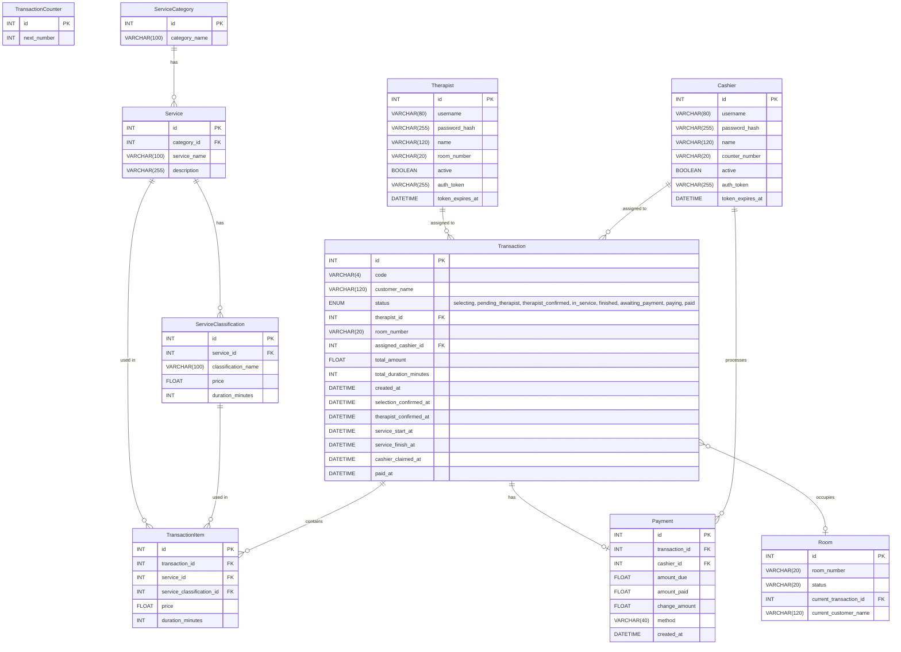

# SPA Management System ERD

```mermaid
erDiagram
    TransactionCounter {
        INT id PK
        INT next_number
    }

    ServiceCategory {
        INT id PK
        VARCHAR(100) category_name
    }

    Service {
        INT id PK
        INT category_id FK
        VARCHAR(100) service_name
        VARCHAR(255) description
    }

    ServiceClassification {
        INT id PK
        INT service_id FK
        VARCHAR(100) classification_name
        FLOAT price
        INT duration_minutes
    }

    Therapist {
        INT id PK
        VARCHAR(80) username
        VARCHAR(255) password_hash
        VARCHAR(120) name
        VARCHAR(20) room_number
        BOOLEAN active
        VARCHAR(255) auth_token
        DATETIME token_expires_at
    }

    Cashier {
        INT id PK
        VARCHAR(80) username
        VARCHAR(255) password_hash
        VARCHAR(120) name
        VARCHAR(20) counter_number
        BOOLEAN active
        VARCHAR(255) auth_token
        DATETIME token_expires_at
    }

    Transaction {
        INT id PK
        VARCHAR(4) code
        VARCHAR(120) customer_name
        ENUM status "selecting, pending_therapist, therapist_confirmed, in_service, finished, awaiting_payment, paying, paid"
        INT therapist_id FK
        VARCHAR(20) room_number
        INT assigned_cashier_id FK
        FLOAT total_amount
        INT total_duration_minutes
        DATETIME created_at
        DATETIME selection_confirmed_at
        DATETIME therapist_confirmed_at
        DATETIME service_start_at
        DATETIME service_finish_at
        DATETIME cashier_claimed_at
        DATETIME paid_at
    }

    TransactionItem {
        INT id PK
        INT transaction_id FK
        INT service_id FK
        INT service_classification_id FK
        FLOAT price
        INT duration_minutes
    }

    Payment {
        INT id PK
        INT transaction_id FK
        INT cashier_id FK
        FLOAT amount_due
        FLOAT amount_paid
        FLOAT change_amount
        VARCHAR(40) method
        DATETIME created_at
    }

    Room {
        INT id PK
        VARCHAR(20) room_number
        VARCHAR(20) status
        INT current_transaction_id FK
        VARCHAR(120) current_customer_name
    }

    ServiceCategory ||--o{ Service : "has"
    Service ||--o{ ServiceClassification : "has"
    Service ||--o{ TransactionItem : "used in"
    ServiceClassification ||--o{ TransactionItem : "used in"
    Therapist ||--o{ Transaction : "assigned to"
    Cashier ||--o{ Transaction : "assigned to"
    Transaction ||--o{ TransactionItem : "contains"
    Transaction ||--o| Payment : "has"
    Cashier ||--o{ Payment : "processes"
    Transaction }o--o| Room : "occupies"
```
